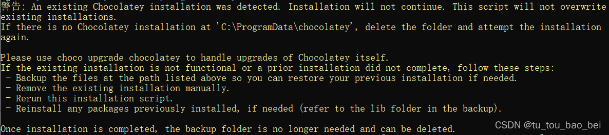

# chocolatey的安装
## 什么是chocolatey
该软件是一个开源源代码的软件包管理系统可以实现一键升级以及一键安装一件卸载功能
## 安装
1. 进入官网[chocolatey官网](https://chocolatey.org/install#individual)
2. 选择选择powershell安装（如何打开powershell：底部搜索框输入powershell，用管理员身份打开）

3. 先在打开的powershell 中输入：`Get-ExecutionPolicy`
> 运行 `Get-ExecutionPolicy`,如果返回的是 `Restricted`,那么运行`Set-ExecutionPolicy AllSigned` 或者 `Set-ExecutionPolicy Bypass -Scope Process`
4. 输入`Set-ExecutionPolicy Bypass -Scope Process -Force; [System.Net.ServicePointManager]::SecurityProtocol = [System.Net.ServicePointManager]::SecurityProtocol -bor 3072; iex ((New-Object System.Net.WebClient).DownloadString('https://community.chocolatey.org/install.ps1'))` 
**注意：** 如果出现下图-图4.1提示，则进行以下操作：

图4.1  
**操作：**
   1. 打开命令提示符（以管理员身份运行）或 PowerShell。 
      运行命令：`choco uninstall chocolatey` 
      这将尝试卸载已经安装的 Chocolatey。 
   2. 删除残留文件 
      打开文件资源管理器，转到以下路径：`C:\ProgramData\chocolatey` 和 `C:\ProgramData\chocolatey\bin` 
      删除这些文件夹中的所有内容。请确保在删除文件或文件夹之前备份重要数据，以防意外删除。 
   3. 删除环境变量
      有时，安装程序会添加 Chocolatey 相关的路径到系统的环境变量。你可以手动删除这些条目： 
      在 Windows 中搜索并打开“环境变量”设置。 
      在“系统变量”部分找到名为“Path”的条目，编辑它。 
      删除与 Chocolatey 相关的任何条目，这些条目可能会指向 C:\ProgramData\chocolatey\bin 或类似路径。 
   4. 清理注册表
      **警告**：在编辑注册表时，请务必小心。不正确的更改可能会导致系统问题。建议在进行更改之前备份注册表。 
      打开注册表编辑器：在 Windows 搜索中键入“regedit”并打开注册表编辑器。 
      导航至 `HKEY_CURRENT_USER\Software\` 和 `HKEY_LOCAL_MACHINE\Software\` 
      删除与 Chocolatey 相关的任何条目。通常这些可以在 chocolatey 或 Chocolatey Software 下找到。 
5. 查看是否安装成功
输入命令`choco -v`查看版本号，能查看就是安装成功