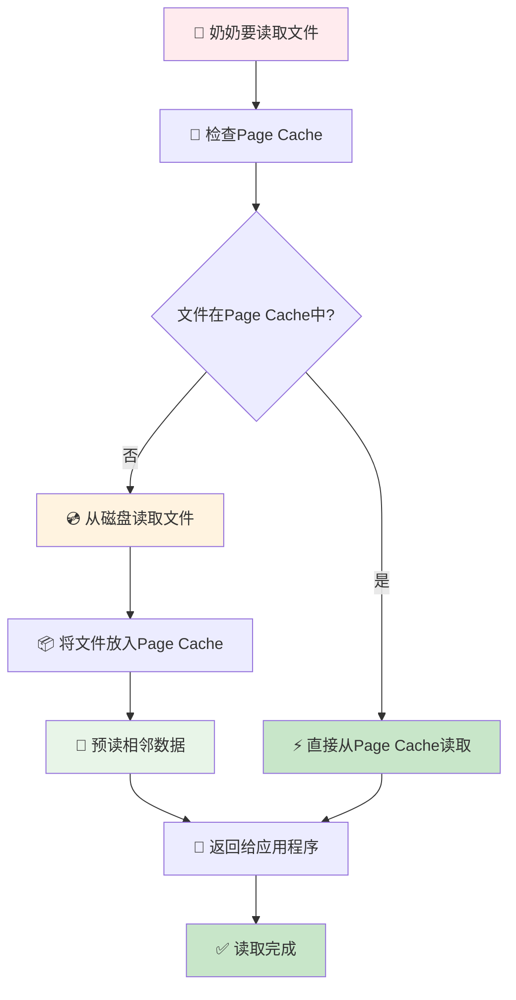
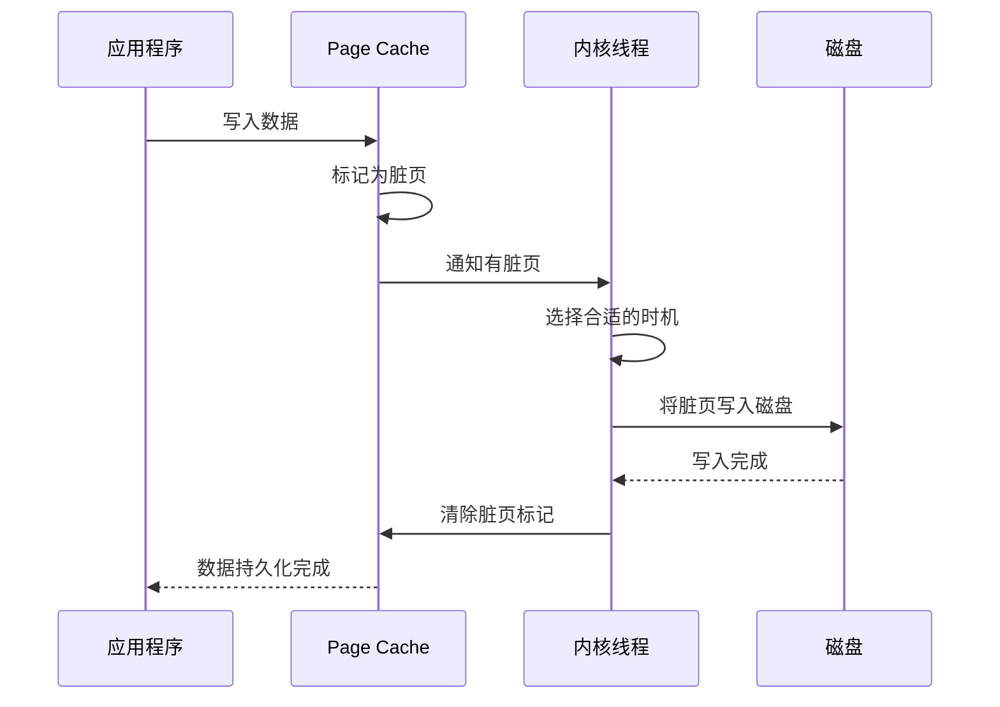

# 进程写文件时，进程发生了崩溃，已写入的数据会丢失吗？
## 🎯 Page Cache完整教程 - 奶奶都能懂版

### 📚 第一章：什么是Page Cache？（就像家里的临时储物间）

#### 1.1 Page Cache是什么？

根据[小林coding的文章](https://xiaolincoding.com/os/6_file_system/pagecache.html#page-cache-%E4%B8%8E-buffer-cache)，Page Cache就像您家里的**临时储物间**：

```
Page Cache = 临时储物间
├── 存放经常使用的文件
├── 比去仓库（磁盘）取东西快很多
├── 可以预先把可能需要的东西准备好
└── 当储物间满了，会把不常用的东西放回仓库
```

**生活例子**：就像您把经常用的东西放在客厅的储物间，而不是每次都去地下室拿，这样取东西就快多了。

#### 1.2 Page Cache在系统中的位置

```
文件I/O系统结构：
┌─────────────────────────────────┐
│        应用程序                 │
└─────────────────────────────────┘
              │
              ▼
┌─────────────────────────────────┐
│        系统调用                 │
└─────────────────────────────────┘
              │
              ▼
┌─────────────────────────────────┐
│        Page Cache               │ ← 红色部分，就是临时储物间
└─────────────────────────────────┘
              │
              ▼
┌─────────────────────────────────┐
│         磁盘                    │
└─────────────────────────────────┘
```

**生活例子**：就像您从客厅（应用程序）到储物间（Page Cache）再到地下室（磁盘）的路径。

### 📚 第二章：如何查看Page Cache？（就像查看储物间使用情况）

#### 2.1 查看系统内存情况

通过查看`/proc/meminfo`文件，就像查看储物间的使用情况：

```
$ cat /proc/meminfo
...
Buffers:            1224 kB      ← 缓冲区大小
Cached:           111472 kB      ← 缓存大小
SwapCached:        36364 kB      ← 交换缓存大小
Active:          6224232 kB      ← 活跃内存
Inactive:         979432 kB      ← 非活跃内存
Active(anon):    6173036 kB      ← 活跃匿名页
Inactive(anon):   927932 kB      ← 非活跃匿名页
Active(file):      51196 kB      ← 活跃文件页
Inactive(file):    51500 kB      ← 非活跃文件页
...
Shmem:             10000 kB      ← 共享内存
...
SReclaimable:      43532 kB      ← 可回收内存
...
```

**生活例子**：就像查看储物间的详细清单，知道哪些东西在哪个区域，占用了多少空间。

#### 2.2 Page Cache的计算公式

根据文章内容，Page Cache的计算公式是：

```
Page Cache = Buffers + Cached + SwapCached
```

**生活例子**：就像储物间的总容量 = 主储物间 + 备用储物间 + 临时储物间。

### 📚 第三章：Page与Page Cache的关系（就像物品与储物间）

#### 3.1 Page是什么？

Page就像储物间里的**标准储物盒**：

```
Page的特点：
┌─────────────────────────────────┐
│        标准储物盒（Page）        │
│  ┌─────────────────────────────┐ │
│  │ 大小：4KB（固定大小）        │ │
│  │ 用途：存放文件数据           │ │
│  │ 管理：操作系统统一管理       │ │
│  └─────────────────────────────┘ │
└─────────────────────────────────┘
```

**生活例子**：就像储物间里的标准储物盒，每个盒子大小一样，方便管理和存放。

#### 3.2 两种类型的Page

根据文章内容，有两种类型的Page：

**1. File-backed pages（文件备份页）**
```
文件备份页：
┌─────────────────────────────────┐
│        文件备份页               │
│  ┌─────────────────────────────┐ │
│  │ 对应磁盘上的数据块           │ │
│  │ 最大的问题：脏页回盘         │ │
│  │ 例子：文档、图片、视频       │ │
│  └─────────────────────────────┘ │
└─────────────────────────────────┘
```

**2. Anonymous pages（匿名页）**
```
匿名页：
┌─────────────────────────────────┐
│        匿名页                   │
│  ┌─────────────────────────────┐ │
│  │ 不对应磁盘上的数据块         │ │
│  │ 例子：程序运行时的内存       │ │
│  │ 包括：方法栈、局部变量表     │ │
│  └─────────────────────────────┘ │
└─────────────────────────────────┘
```

**生活例子**：
- 文件备份页：就像储物间里存放的从仓库拿来的东西
- 匿名页：就像储物间里临时存放的正在使用的东西

### 📚 第四章：为什么叫Page Cache而不是Block Cache？

#### 4.1 历史原因

根据文章内容，这是因为：

```
历史发展：
┌─────────────────────────────────┐
│        历史发展过程              │
│  ┌─────────────────────────────┐ │
│  │ 早期：按块（Block）管理      │ │
│  │ 后来：按页（Page）管理       │ │
│  │ 现在：统一使用Page Cache     │ │
│  └─────────────────────────────┘ │
└─────────────────────────────────┘
```

**生活例子**：就像早期用大箱子装东西，后来改用标准储物盒，现在统一用标准储物盒，但名字还是叫"储物间"。

### 📚 第五章：Page Cache与Buffer Cache的关系

#### 5.1 什么是Buffer Cache？

Buffer Cache就像**临时中转站**：

```
Buffer Cache的作用：
┌─────────────────────────────────┐
│        临时中转站                │
│  ┌─────────────────────────────┐ │
│  │ 存放块设备的数据             │ │
│  │ 用于磁盘I/O操作             │ │
│  │ 提高磁盘访问效率             │ │
│  └─────────────────────────────┘ │
└─────────────────────────────────┘
```

**生活例子**：就像快递的中转站，临时存放包裹，提高配送效率。

#### 5.2 Page Cache与Buffer Cache的区别

```
Page Cache vs Buffer Cache：
┌─────────────────────────────────┐
│        Page Cache               │
│  ┌─────────────────────────────┐ │
│  │ 管理文件数据                 │ │
│  │ 按页（4KB）管理             │ │
│  │ 用于文件系统                 │ │
│  └─────────────────────────────┘ │
└─────────────────────────────────┘
              │
              ▼
┌─────────────────────────────────┐
│        Buffer Cache             │
│  ┌─────────────────────────────┐ │
│  │ 管理块设备数据               │ │
│  │ 按块（512B-4KB）管理        │ │
│  │ 用于磁盘I/O                 │ │
│  └─────────────────────────────┘ │
└─────────────────────────────────┘
```

**生活例子**：
- Page Cache：就像文件柜，按页管理文件
- Buffer Cache：就像工具箱，按块管理工具

### 📚 第六章：Page Cache与预读（就像提前准备）

#### 6.1 什么是预读？

预读就像**提前准备**：

```
预读机制：
┌─────────────────────────────────┐
│        预读机制                 │
│  ┌─────────────────────────────┐ │
│  │ 当您读取文件时               │ │
│  │ 系统会预测您可能需要的数据   │ │
│  │ 提前从磁盘读取到Page Cache   │ │
│  │ 提高后续访问速度             │ │
│  └─────────────────────────────┘ │
└─────────────────────────────────┘
```

**生活例子**：就像您要看书，图书管理员不仅给您要的那本书，还提前准备了相关的参考书。

#### 6.2 预读的工作原理

```
预读工作流程：
1. 应用程序请求读取文件
2. 系统从磁盘读取请求的数据
3. 系统预测可能需要的相邻数据
4. 提前读取相邻数据到Page Cache
5. 应用程序下次访问时直接从Page Cache读取
```

**生活例子**：就像您要第5页的内容，图书管理员不仅给您第5页，还提前准备了第6、7、8页。

### 📚 第七章：数据持久化与一致性（就像保存重要文件）

#### 7.1 什么是数据持久化？

数据持久化就像**保存重要文件**：

```
数据持久化：
┌─────────────────────────────────┐
│        数据持久化               │
│  ┌─────────────────────────────┐ │
│  │ 将Page Cache中的数据         │ │
│  │ 写入到磁盘                   │ │
│  │ 确保数据不会丢失             │ │
│  └─────────────────────────────┘ │
└─────────────────────────────────┘
```

**生活例子**：就像把重要的文件从临时文件夹复制到保险柜，确保不会丢失。

#### 7.2 两种写入策略

**1. Write Through（写通）**
```
Write Through：
应用程序 → Page Cache → 立即写入磁盘
就像：您写文件 → 临时文件夹 → 立即保存到保险柜
```

**2. Write Back（写回）**
```
Write Back：
应用程序 → Page Cache → 延迟写入磁盘
就像：您写文件 → 临时文件夹 → 稍后保存到保险柜
```

**生活例子**：
- Write Through：就像每写一个字就保存一次
- Write Back：就像写完整篇文章再保存

#### 7.3 三种系统调用

根据文章内容，有三种系统调用：

**1. fsync() - 完全同步**
```
fsync(fd)：
将文件的脏数据和脏元数据全部刷新至磁盘
就像：把文件的所有内容都保存到保险柜
```

**2. fdatasync() - 数据同步**
```
fdatasync(fd)：
将文件的脏数据刷新至磁盘，必要的元数据也刷新
就像：保存文件内容，但只保存必要的文件信息
```

**3. sync() - 全局同步**
```
sync()：
将系统中所有的脏数据刷新至磁盘
就像：保存所有未保存的文件
```

**生活例子**：
- fsync：就像保存单个文件的完整信息
- fdatasync：就像保存文件内容，但只保存必要信息
- sync：就像保存所有未保存的文件

### 📚 第八章：内核线程管理（就像管理员）

#### 8.1 内核线程的作用

内核线程就像**储物间管理员**：

```
内核线程管理：
┌─────────────────────────────────┐
│        储物间管理员              │
│  ┌─────────────────────────────┐ │
│  │ 管理线程：监控脏页面情况     │ │
│  │ 刷新线程：负责数据回写       │ │
│  │ 每个存储设备一个刷新线程     │ │
│  └─────────────────────────────┘ │
└─────────────────────────────────┘
```

**生活例子**：就像储物间有管理员，负责监控哪些东西需要整理，哪些东西需要放回仓库。

#### 8.2 多线程架构

```
多线程架构：
┌─────────────────────────────────┐
│        管理线程                 │
│  ┌─────────────────────────────┐ │
│  │ 监控设备上的脏页面情况       │ │
│  │ 创建/销毁刷新线程           │ │
│  └─────────────────────────────┘ │
└─────────────────────────────────┘
              │
              ▼
┌─────────────────────────────────┐
│        刷新线程1                │
│  ┌─────────────────────────────┐ │
│  │ 负责设备1的脏页面回写       │ │
│  └─────────────────────────────┘ │
└─────────────────────────────────┘
              │
              ▼
┌─────────────────────────────────┐
│        刷新线程2                │
│  ┌─────────────────────────────┐ │
│  │ 负责设备2的脏页面回写       │ │
│  └─────────────────────────────┘ │
└─────────────────────────────────┘
```

**生活例子**：就像储物间有总管理员，下面有多个分管理员，每个分管理员负责不同的区域。

### 📚 第九章：Page Cache的优劣势（就像储物间的优缺点）

#### 9.1 Page Cache的优势

**1. 加快数据访问**
```
优势1：加快数据访问
┌─────────────────────────────────┐
│        数据访问对比              │
│  ┌─────────────────────────────┐ │
│  │ 从Page Cache读取：1微秒      │ │
│  │ 从磁盘读取：10毫秒           │ │
│  │ 速度提升：10000倍            │ │
│  └─────────────────────────────┘ │
└─────────────────────────────────┘
```

**生活例子**：就像从客厅储物间拿东西比从地下室拿东西快10000倍。

**2. 减少I/O次数**
```
优势2：减少I/O次数
┌─────────────────────────────────┐
│        I/O次数对比              │
│  ┌─────────────────────────────┐ │
│  │ 没有Page Cache：每次都要     │ │
│  │ 从磁盘读取                  │ │
│  │ 有Page Cache：一次读取       │ │
│  │ 多次使用                    │ │
│  └─────────────────────────────┘ │
└─────────────────────────────────┘
```

**生活例子**：就像没有储物间，每次都要去地下室拿东西；有了储物间，一次拿够，多次使用。

#### 9.2 Page Cache的劣势

**1. 占用额外内存**
```
劣势1：占用额外内存
┌─────────────────────────────────┐
│        内存占用问题              │
│  ┌─────────────────────────────┐ │
│  │ Page Cache占用物理内存       │ │
│  │ 可能导致频繁的swap操作       │ │
│  │ 最终导致磁盘I/O负载上升      │ │
│  └─────────────────────────────┘ │
└─────────────────────────────────┘
```

**生活例子**：就像储物间占用了客厅空间，可能导致其他东西没地方放。

**2. 应用层管理困难**
```
劣势2：应用层管理困难
┌─────────────────────────────────┐
│        管理困难                 │
│  ┌─────────────────────────────┐ │
│  │ 应用层无法直接管理           │ │
│  │ 几乎透明管理                │ │
│  │ 难以优化使用策略             │ │
│  └─────────────────────────────┘ │
└─────────────────────────────────┘
```

**生活例子**：就像储物间由物业统一管理，您无法直接控制里面放什么。

**3. 多一次磁盘I/O**
```
劣势3：多一次磁盘I/O
┌─────────────────────────────────┐
│        磁盘I/O对比              │
│  ┌─────────────────────────────┐ │
│  │ 缓存I/O：读一次，写一次      │ │
│  │ 直接I/O：直接读写            │ │
│  │ 缓存I/O多一次磁盘操作        │ │
│  └─────────────────────────────┘ │
└─────────────────────────────────┘
```

**生活例子**：就像通过储物间拿东西，需要先从仓库放到储物间，再从储物间拿；直接拿东西，直接从仓库拿。

### 📚 第十章：Direct I/O（直接I/O）

#### 10.1 什么是Direct I/O？

Direct I/O就像**直接从仓库拿东西**：

```
Direct I/O：
┌─────────────────────────────────┐
│        直接I/O                  │
│  ┌─────────────────────────────┐ │
│  │ 绕过Page Cache              │ │
│  │ 直接与磁盘交互               │ │
│  │ 数据直接存储在用户空间       │ │
│  └─────────────────────────────┘ │
└─────────────────────────────────┘
```

**生活例子**：就像直接从仓库拿东西，不经过储物间。

#### 10.2 Direct I/O的特点

**1. Write操作特点**
```
Direct I/O Write：
┌─────────────────────────────────┐
│        Write特点                │
│  ┌─────────────────────────────┐ │
│  │ 不使用Page Cache             │ │
│  │ 返回成功 = 数据真的落盘      │ │
│  │ 不考虑磁盘自带的缓存         │ │
│  └─────────────────────────────┘ │
└─────────────────────────────────┘
```

**2. Read操作特点**
```
Direct I/O Read：
┌─────────────────────────────────┐
│        Read特点                 │
│  ┌─────────────────────────────┐ │
│  │ 不使用Page Cache             │ │
│  │ 每次读操作真的从磁盘读取      │ │
│  │ 不会从文件系统缓存中读取      │ │
│  └─────────────────────────────┘ │
└─────────────────────────────────┘
```

**生活例子**：
- Write：就像直接把东西放到仓库，不经过储物间
- Read：就像直接从仓库拿东西，不经过储物间

### 📚 第十一章：完整的Page Cache流程图

让我用最简单的方式画出来：



### 📚 第十二章：数据持久化流程图



### 📚 第十三章：总结（给奶奶的话）

亲爱的奶奶，Page Cache就像您家里的临时储物间：

1. **Page Cache** = 临时储物间
2. **Page** = 标准储物盒
3. **预读** = 提前准备可能需要的东西
4. **数据持久化** = 把重要东西保存到保险柜
5. **内核线程** = 储物间管理员
6. **Direct I/O** = 直接从仓库拿东西

**Page Cache的优势**：
- 取东西快（从储物间比从仓库快）
- 减少跑腿次数（一次拿够，多次使用）

**Page Cache的劣势**：
- 占用空间（储物间占用了客厅空间）
- 管理困难（由物业统一管理）
- 多一次操作（先放储物间，再拿）

整个系统虽然复杂，但就像您每天整理储物间一样，每个部分都有它的作用，最终让您能够快速、高效地使用文件！
