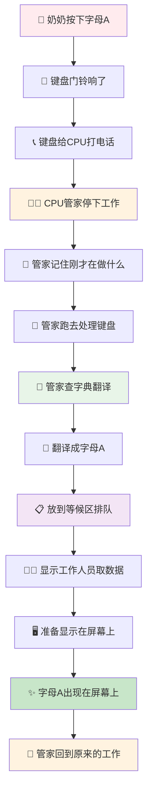

# 🎯 键盘输入完整教程 - 奶奶都能懂版

### 📚 第一章：先了解基本概念（就像认识新朋友）

#### 1.1 什么是操作系统？

想象操作系统就像一个**超级管家**，管理着家里的所有电器：

- 电灯（显示器）
- 电视（应用程序）
- 空调（其他设备）
- **门铃（键盘）** ← 今天的主角

#### 1.2 键盘是什么？

键盘就像家里的**门铃按钮**：

- 你按一下，门铃就响
- 你按键盘，电脑就知道你要输入什么

### 📚 第二章：键盘的"身体结构"（解剖键盘）

#### 2.1 键盘的"大脑" - 设备控制器

每个键盘都有一个"大脑"，叫做**设备控制器**，就像门铃的电路板：

```
键盘控制器就像门铃的电路板：
┌─────────────────┐
│  设备控制器      │
│  ┌─────────────┐ │
│  │ 状态寄存器   │ │ ← 告诉CPU："我在工作"或"我完成了"
│  └─────────────┘ │
│  ┌─────────────┐ │
│  │ 命令寄存器   │ │ ← CPU说："开始工作！"
│  └─────────────┘ │
│  ┌─────────────┐ │
│  │ 数据寄存器   │ │ ← 存放要传输的数据
│  └─────────────┘ │
└─────────────────┘
```

#### 2.2 三种"信箱"的作用

想象设备控制器有三个信箱：

1. **状态信箱**（状态寄存器）
   - 就像门铃上的指示灯
   - 红灯 = "我在忙，别打扰"
   - 绿灯 = "我准备好了，可以工作"

2. **命令信箱**（命令寄存器）
   - 就像门铃的按钮
   - CPU按一下 = "开始工作！"
   - 设备收到命令就开始干活

3. **数据信箱**（数据寄存器）
   - 就像门铃的声音
   - 存放要传输的信息
   - 比如字母"A"的编码

### 📚 第三章：当您按下字母"A"时发生了什么？

#### 3.1 第一步：物理按键（就像按门铃）

```
您的手指 → 按下A键 → 键盘的机械开关闭合
```

**生活例子**：就像您按门铃一样简单！

#### 3.2 第二步：键盘"扫描"（就像邮递员送信）

键盘控制器开始"扫描"，就像邮递员查看信箱：

```
键盘控制器扫描过程：
┌─────────────────────────────────┐
│  键盘矩阵扫描                    │
│  ┌─┬─┬─┬─┐                    │
│  │Q│W│E│R│ ← 第一行              │
│  ├─┼─┼─┼─┤                    │
│  │A│S│D│F│ ← 第二行（A在这里！）  │
│  ├─┼─┼─┼─┤                    │
│  │Z│X│C│V│ ← 第三行              │
│  └─┴─┴─┴─┘                    │
└─────────────────────────────────┘
```

**生活例子**：就像邮递员挨家挨户查看信箱，找到有信的那一家。

#### 3.3 第三步：生成"密码"（扫描码）

键盘发现A键被按下，就生成一个"密码"：

```
A键的扫描码：0x1E
（这是键盘和电脑之间的"暗号"）
```

**生活例子**：就像门铃按一下，产生一个特定的声音信号。

#### 3.4 第四步：发送"求救信号"（中断请求）

键盘控制器通过"电话线"（总线）给CPU打电话：

```
键盘控制器 → 总线 → CPU
"喂！CPU！有人按键盘了！快来处理！"
```

**生活例子**：就像门铃响了，管家（CPU）听到声音，知道有人来了。

### 📚 第四章：CPU的"紧急处理"（中断处理）

#### 4.1 CPU的"大脑"结构

```
CPU的"家"：
┌─────────────────────────────────┐
│            CPU                  │
│  ┌─────────────────────────────┐ │
│  │        内存接口              │ │
│  └─────────────────────────────┘ │
│              │                  │
│              ▼                  │
│  ┌─────────────────────────────┐ │
│  │        系统总线              │ │
│  └─────────────────────────────┘ │
│              │                  │
│              ▼                  │
│  ┌─────────────────────────────┐ │
│  │       I/O桥接器             │ │
│  └─────────────────────────────┘ │
│         │              │        │
│         ▼              ▼        │
│  ┌─────────────┐ ┌─────────────┐ │
│  │   内存总线   │ │   I/O总线   │ │
│  └─────────────┘ └─────────────┘ │
└─────────────────────────────────┘
```

**生活例子**：就像管家的房间，有电话线连接到各个地方。

#### 4.2 中断处理的"紧急流程"

当CPU收到键盘的"求救信号"时：

```
1. 立即停下手中的工作
2. 记住刚才在做什么（保存上下文）
3. 跑去处理键盘问题
4. 处理完后，回到原来的工作
```

**生活例子**：就像管家正在整理文件，突然门铃响了，他：

- 放下手中的文件
- 记住整理到哪里了
- 跑去开门
- 处理完客人后，回来继续整理文件

### 📚 第五章：字符转换的"翻译过程"

#### 5.1 扫描码到ASCII码的转换

```
键盘的"暗号" → 电脑的"语言"
扫描码 0x1E → ASCII码 0x41 → 显示字符 'A'
```

**生活例子**：就像翻译官把外语翻译成中文：

- 外国人说话（扫描码）
- 翻译官翻译（驱动程序）
- 您听到中文（ASCII码）

#### 5.2 驱动程序的作用

驱动程序就像"翻译官"：

```
键盘驱动程序的工作：
┌─────────────────────────────────┐
│        键盘驱动程序              │
│  ┌─────────────────────────────┐ │
│  │    扫描码转换表              │ │
│  │  0x1E → 'A'                │ │
│  │  0x30 → 'B'                │ │
│  │  0x2E → 'C'                │ │
│  │  ...                       │ │
│  └─────────────────────────────┘ │
└─────────────────────────────────┘
```

**生活例子**：就像字典，把不认识的词翻译成认识的词。

### 📚 第六章：缓冲区的"排队系统"

#### 6.1 什么是缓冲区？

缓冲区就像银行的"排队系统"：

```
读缓冲区队列（等待处理的客户）：
┌─────┬─────┬─────┬─────┐
│ 'H' │ 'e' │ 'l' │ 'l' │ ← 您输入的字符在这里排队
└─────┴─────┴─────┴─────┘

写缓冲区队列（准备显示的客户）：
┌─────┬─────┬─────┬─────┐
│ 'H' │ 'e' │ 'l' │ 'l' │ ← 准备显示在屏幕上的字符
└─────┴─────┴─────┴─────┘
```

**生活例子**：就像银行，客户先在等候区排队，然后到柜台办理业务。

#### 6.2 缓冲区的工作流程

```
1. 键盘输入 → 读缓冲区队列（等候区）
2. 显示驱动 → 从读缓冲区取数据
3. 显示驱动 → 放入写缓冲区队列（准备区）
4. 显示设备 → 从写缓冲区取数据
5. 显示设备 → 显示在屏幕上
```

**生活例子**：就像银行的完整流程：

- 客户进入银行（键盘输入）
- 在等候区排队（读缓冲区）
- 叫号到柜台（显示驱动处理）
- 办理业务（写缓冲区）
- 业务完成（屏幕显示）

### 📚 第七章：完整的流程图（奶奶版）

让我用最简单的方式画出来：



### 📚 第八章：用生活例子总结整个过程

#### 8.1 完整的"银行办理业务"例子

```
1. 您按键盘 = 客户进入银行
2. 键盘扫描 = 银行工作人员识别客户需求
3. 生成扫描码 = 给客户一个号码牌
4. 发送中断 = 客户按服务铃
5. CPU响应 = 银行经理听到铃声
6. 保存上下文 = 经理记住刚才在做什么
7. 处理中断 = 经理去处理客户问题
8. 字符转换 = 经理理解客户需求
9. 放入缓冲区 = 客户在等候区排队
10. 显示处理 = 柜台工作人员处理业务
11. 屏幕显示 = 业务办理完成
12. 恢复上下文 = 经理回到原来的工作
```

#### 8.2 时间线（就像电影回放）

```
时间 0:00 - 您按下A键
时间 0:01 - 键盘扫描，生成扫描码
时间 0:02 - 发送中断请求
时间 0:03 - CPU收到中断
时间 0:04 - 保存当前工作状态
时间 0:05 - 执行键盘中断处理
时间 0:06 - 读取扫描码
时间 0:07 - 转换为ASCII码
时间 0:08 - 放入读缓冲区
时间 0:09 - 显示驱动读取数据
时间 0:10 - 放入写缓冲区
时间 0:11 - 写入显示设备
时间 0:12 - 字母A显示在屏幕上
时间 0:13 - 恢复原来的工作
```

### 📚 第九章：常见问题解答（奶奶可能问的问题）

#### Q1: 为什么需要这么多步骤？

**A**: 就像做菜一样，需要很多步骤才能做出美味的菜。电脑也需要很多步骤才能把您的按键变成屏幕上的字母。

#### Q2: 为什么需要缓冲区？

**A**: 就像餐厅的传菜窗口，厨师做好菜后放在窗口，服务员从窗口取菜送给客人。缓冲区就是这样的"传菜窗口"。

#### Q3: 为什么需要保存和恢复上下文？

**A**: 就像您正在看书，突然有人敲门，您会：

- 记住看到哪一页
- 去开门
- 处理完客人后，回来继续看书

#### Q4: 这个过程有多快？

**A**: 非常快！比您眨眼睛还快，通常只需要几微秒（百万分之一秒）。

### 📚 第十章：总结（给奶奶的话）

亲爱的奶奶，键盘输入就像您每天做的事情一样：

1. **按门铃** = 按键盘
2. **管家听到** = CPU收到中断
3. **管家处理** = 操作系统处理
4. **翻译理解** = 字符转换
5. **排队等待** = 缓冲区管理
6. **显示结果** = 屏幕显示
7. **继续工作** = 恢复上下文

整个过程虽然复杂，但就像您每天的生活一样，每个步骤都有它的作用，最终让您能够轻松地在电脑上输入文字！