# 设计模式前言：在 AI 时代重新掌握设计判断力

AI 的发展让编码效率大幅提升，vibe coding 让“先跑起来”变得很容易。但效率不是全部，真正困难的是判断：什么样的设计是好的、什么时候该抽象、什么时候该简单。设计模式不是让我们拘泥于模板，而是帮助我们在“自由发挥”与“工程可靠”之间做出更清晰的选择。

---

## 为什么现在还要学设计模式
- AI 能生成代码，但“正确的结构”需要人来判断。
- 好的设计依赖上下文与权衡，不是堆功能就能解决。
- 设计模式提供了一套稳定的语言和思考框架，便于沟通与复用。
- 有了模式意识，才能更好地评估 AI 输出：哪里该改，为什么要改。

---

## 这套教程会怎么讲
每个模式都会围绕“问题 → 意图 → 结构 → 代码 → 取舍”展开，重点不在记忆名词，而在理解“它解决什么问题、为什么要这样设计”。你会看到：
- 真实业务场景与痛点
- 角色职责与协作流程
- 最小可运行的代码示例
- 优缺点、适用边界与常见误区

---

## 如何更高效地学习
- 把设计模式当作“工具箱”，而不是“教条”。
- 先想问题再选模式，避免为了用模式而用模式。
- 用模式做判断标准：评估复杂度、可扩展性、可维护性。
- 与 AI 协作时，用模式来约束输入和验收输出。

---

## 设计模式总览：从问题到选择的完整地图
设计模式不是让我们“套模板”，而是提供一套判断框架：**在复杂与简单之间，如何做出可维护、可扩展的设计选择**。这份总览把 23 个经典模式串成一张选择地图，方便你在真实场景中快速定位答案。

---

## 先把问题分成 3 大类
设计模式的核心不是记名字，而是识别问题类型：
- **创建型**：关注“对象如何创建”。
- **结构型**：关注“对象如何组合”。
- **行为型**：关注“对象如何协作”。

这三类覆盖了大多数工程场景。

---

## 快速选择路径（全模式）

```mermaid
flowchart TD
    A[核心问题是什么?] --> B1[对象创建复杂?] --> C1[创建型]
    A --> B2[结构组合复杂?] --> C2[结构型]
    A --> B3[对象协作复杂?] --> C3[行为型]

    C1 --> D1[单例?] --> P1[单例]
    C1 --> D2[分步骤构建复杂对象?] --> P2[生成器]
    C1 --> D3[需要复制模板?] --> P3[原型]
    C1 --> D4[创建单一产品且可扩展?] --> P4[工厂方法]
    C1 --> D5[创建产品族?] --> P5[抽象工厂]

    C2 --> E1[接口不兼容?] --> P6[适配器]
    C2 --> E2[需要统一入口简化调用?] --> P7[外观]
    C2 --> E3[访问控制/缓存/延迟加载?] --> P8[代理]
    C2 --> E4[动态增强功能?] --> P9[装饰器]
    C2 --> E5[抽象与实现双维度变化?] --> P10[桥接]
    C2 --> E6[树形结构统一处理?] --> P11[组合]
    C2 --> E7[大量相似对象复用?] --> P12[享元]

    C3 --> F1[多步处理可短路?] --> P13[责任链]
    C3 --> F2[一对多事件通知?] --> P14[观察者]
    C3 --> F3[对象交互太复杂?] --> P15[中介者]
    C3 --> F4[算法可替换?] --> P16[策略]
    C3 --> F5[行为随状态变化?] --> P17[状态]
    C3 --> F6[流程固定, 步骤可变?] --> P18[模板方法]
    C3 --> F7[请求封装/排队/撤销?] --> P19[命令]
    C3 --> F8[需要保存/回滚状态?] --> P20[备忘录]
    C3 --> F9[需要统一遍历?] --> P21[迭代器]
    C3 --> F10[结构稳定, 但操作频繁新增?] --> P22[访问者]
    C3 --> F11[规则表达式要解释执行?] --> P23[解释器]
```

---

## 创建型模式（如何创建对象）
- **单例**：全局唯一实例，适合配置中心、日志器。
- **生成器**：分步骤构建复杂对象，流程复用。
- **原型**：复制已有对象，适合模板化与批量创建。
- **工厂方法**：创建单一产品，可通过子类扩展。
- **抽象工厂**：创建产品族，保证一致性。

---

## 结构型模式（如何组合对象）
- **适配器**：接口不兼容时做转换。
- **外观**：对子系统提供统一入口。
- **代理**：控制访问或增强能力。
- **装饰器**：动态叠加功能，替代继承。
- **桥接**：抽象与实现分离，双维度独立扩展。
- **组合**：树形结构统一处理。
- **享元**：共享对象，降低内存。

---

## 行为型模式（如何协作与变化）
- **责任链**：多步处理，可短路。
- **观察者**：一对多通知。
- **中介者**：集中编排对象交互。
- **策略**：算法可替换。
- **状态**：行为随状态变化。
- **模板方法**：流程固定，步骤可变。
- **命令**：请求封装，支持排队与撤销。
- **备忘录**：保存与恢复状态。
- **迭代器**：统一遍历方式。
- **访问者**：结构稳定，操作频繁新增。
- **解释器**：规则表达式解释执行。

---

## 易混淆对比（全局视角）
| 对比 | 关键差别 | 选用建议 |
| --- | --- | --- |
| 策略 vs 状态 | 策略是“可替换算法”，状态是“行为随状态变化” | 强调状态流转选状态 |
| 观察者 vs 中介者 | 观察者是广播通知，中介者是集中编排 | 需要流程编排选中介者 |
| 责任链 vs 观察者 | 责任链逐级处理可短路，观察者并行通知 | 需要短路选责任链 |
| 代理 vs 装饰器 | 代理强调控制访问，装饰器强调功能增强 | 要控制访问选代理 |
| 适配器 vs 外观 | 适配器解决接口不兼容，外观简化使用 | 需要转换选适配器 |
| 组合 vs 访问者 | 组合组织树结构，访问者扩展操作 | 结构稳定且操作频繁新增选访问者 |

---

## 常见组合套路
- **责任链 + 策略**：前置校验后路由策略。
- **中介者 + 状态**：中介者编排流程，状态控制流转阶段。
- **命令 + 备忘录**：命令执行前保存快照，实现撤销。
- **观察者 + 模板方法**：广播事件后，各通道复用统一流程。
- **组合 + 访问者**：树形结构遍历 + 多操作扩展。
- **代理 + 缓存**：缓存代理隔离真实服务压力。

---

## 选择时的 5 条检查清单
- 变化点是什么？是创建、结构还是协作？
- 是“单一产品”还是“产品族”？
- 变化是否集中在算法、状态或流程？
- 是否需要复用对象或减少创建成本？
- 引入模式的收益是否覆盖复杂度？

---

## 阅读建议（从常用到不常用）
1. 单例 / 工厂方法 / 策略 / 责任链 / 观察者
2. 状态 / 模板方法 / 命令 / 适配器 / 代理
3. 抽象工厂 / 生成器 / 组合 / 外观 / 装饰器
4. 桥接 / 享元 / 原型 / 访问者 / 解释器

---

## 总览小结
- 设计模式是一套“判断力工具箱”，不是模板集合。
- 先识别问题类型，再选择模式。
- 组合模式可以一起使用，但每个模式只解决一类问题。
- 保持简单优先：能不引入就不引入。

---

## 小结
AI 让我们更快，但设计能力决定我们能走多远。希望这套设计模式教程能成为你的判断力补给站：不盲从、不堆砌，用更稳的结构交付更可信的系统。
