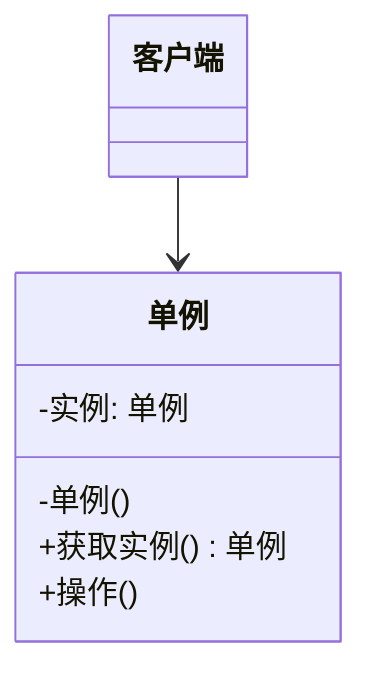

# 单例模式（创建型）

## 一句话总结
确保某个类在系统中只有一个实例，并提供一个全局可访问的入口。

---

## 问题与场景
- 某些资源需要“全局唯一”且共享（如配置中心、日志器、连接池管理器）。
- 创建成本较高，频繁 new 造成浪费或状态不一致。
- 需要在系统中统一访问该实例，避免多处重复初始化。

---

## 模式意图
**保证一个类只有一个实例，并提供一个访问它的全局访问点**，用于共享资源与统一行为。

---

## 结构图


---

## 角色与职责
- 单例（配置中心）：控制实例创建与访问。
- 客户端：通过全局入口获取并使用单例。

---

## 协作流程
1. 客户端 调用单例的获取实例方法。
2. 单例 判断是否已创建实例。
3. 若未创建则初始化，否则直接返回已有实例。
4. 客户端 通过该实例完成业务操作。

---

## 真实业务示例：全局配置中心
场景：业务需要读取“灰度开关、限流阈值、渠道开关”等配置，必须全局一致。

怎么用：
- 用单例持有配置缓存并对外提供读取/刷新能力。
- 各模块通过统一入口读取配置。

为什么这样用：
- 配置必须全局一致，多个实例会造成读取不一致。
- 统一入口便于做缓存、刷新与监控。

带来的收益：
- 配置读取一致且高效。
- 便于集中治理与扩展。

---

## 代码示例（Java）
```java
import java.util.HashMap;
import java.util.Map;

public class SingletonDemo {
    public static void main(String[] args) {
        ConfigCenter c1 = ConfigCenter.getInstance();
        ConfigCenter c2 = ConfigCenter.getInstance();

        c1.set("gray", "true");
        System.out.println(c2.get("gray"));
        System.out.println(c1 == c2);
    }

    // 单例：静态内部类实现，懒加载且线程安全
    static class ConfigCenter {
        private final Map<String, String> configs = new HashMap<>();

        private ConfigCenter() {
            configs.put("gray", "false");
        }

        private static class Holder {
            private static final ConfigCenter INSTANCE = new ConfigCenter();
        }

        static ConfigCenter getInstance() {
            return Holder.INSTANCE;
        }

        String get(String key) {
            return configs.get(key);
        }

        void set(String key, String value) {
            configs.put(key, value);
        }
    }
}
```

关键点说明：
- 使用静态内部类实现懒加载且线程安全。
- 构造器私有化，防止外部直接 new。
- 单例持有可变状态时要注意并发安全。

---

## 优缺点
优点：
- 全局唯一，避免状态不一致。
- 初始化成本可控，避免重复创建。
- 统一入口便于管理与监控。

缺点：
- 隐式全局状态，增加耦合与测试成本。
- 易被滥用，演变为“上帝对象”。
- 多线程与序列化场景需额外处理。

---

## 适用/不适用
适用：
- 资源全局唯一且需要共享（配置、日志、连接管理等）。
- 创建成本高且不希望重复初始化。

不适用：
- 需要按租户/请求创建多个实例的场景。
- 需要严格的依赖注入与可测试性隔离。

---

## 常见误区
- 把所有工具类都做成单例，导致全局状态泛滥。
- 单例持有可变状态但缺少并发控制。
- 反射/序列化破坏单例约束而未防护。
- 双重检查锁未使用 `volatile`，引发指令重排问题。

---

## 相关模式
- 生成器模式：生成器解决复杂对象构建，单例解决实例唯一性。
- 抽象工厂模式：抽象工厂创建产品族，单例保证工厂实例唯一。
- 享元模式：享元复用对象，单例是“全局唯一”的复用。

---

## 小结
- 单例用于保证实例唯一与全局访问。
- 适合配置中心、日志器等共享资源。
- 注意并发与可变状态的安全性。
- 避免滥用，保持依赖清晰。
