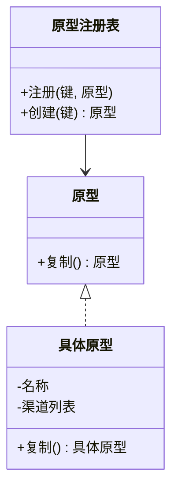

# 原型模式（创建型）

## 一句话总结
通过“复制已有对象”来创建新对象，避免重复初始化，适合高成本或复杂配置的对象构建。

---

## 问题与场景
- 对象创建成本高（初始化复杂、依赖外部资源、配置繁琐）。
- 需要批量创建“结构相同、少量参数不同”的对象。
- 想避免写大量重复的构造逻辑或装配代码。

---

## 模式意图
**用原型实例指定创建对象的种类，并通过复制这些原型创建新的对象**，减少创建成本与重复逻辑。

---

## 结构图


---

## 角色与职责
- 原型（原型）：定义复制接口。
- 具体原型（活动模板）：实现复制逻辑。
- 原型注册表（模板注册表）：管理原型并基于原型生成实例。
- 客户端：选择原型并进行少量定制。

---

## 协作流程
1. 客户端 创建并注册原型对象。
2. 客户端 通过注册表获取原型副本。
3. 客户端 在副本上做少量差异化修改。
4. 新对象投入使用。

---

## 真实业务示例：营销活动模板的快速复制
场景：运营配置活动模板（渠道、预算、规则）很复杂，但每次活动只需改少量字段。

怎么用：
- 把“活动模板”做成原型，注册为“标准模板/节日模板”。
- 新活动从模板复制，再只修改名称、预算或渠道。

为什么这样用：
- 初始化步骤稳定，避免重复配置与手工出错。
- 大批量活动创建效率高。

带来的收益：
- 提升配置效率，减少重复劳动。
- 可复用成熟模板，降低误配风险。

---

## 代码示例（Java）
```java
import java.util.ArrayList;
import java.util.Arrays;
import java.util.HashMap;
import java.util.List;
import java.util.Map;

public class PrototypeDemo {
    public static void main(String[] args) {
        ActivityTemplate standard = new ActivityTemplate(
            "标准模板",
            "满减",
            new ArrayList<>(Arrays.asList("短信", "邮件")),
            10000
        );

        TemplateRegistry registry = new TemplateRegistry();
        registry.register("标准", standard);

        ActivityTemplate eastRegion = registry.create("标准");
        eastRegion.setName("华东专场");
        eastRegion.addChannel("站内信");
        eastRegion.setBudget(15000);

        System.out.println(standard);
        System.out.println(eastRegion);
    }

    // 原型接口
    interface Prototype<T> {
        T copy();
    }

    // 具体原型
    static class ActivityTemplate implements Prototype<ActivityTemplate> {
        private String name;
        private String type;
        private List<String> channels;
        private int budget;

        ActivityTemplate(String name, String type, List<String> channels, int budget) {
            this.name = name;
            this.type = type;
            this.channels = channels;
            this.budget = budget;
        }

        public ActivityTemplate copy() {
            return new ActivityTemplate(
                name,
                type,
                new ArrayList<>(channels),
                budget
            );
        }

        void setName(String name) {
            this.name = name;
        }

        void setBudget(int budget) {
            this.budget = budget;
        }

        void addChannel(String channel) {
            this.channels.add(channel);
        }

        public String toString() {
            return "ActivityTemplate{name='" + name + "', type='" + type + "', channels=" + channels
                + ", budget=" + budget + "}";
        }
    }

    // 原型注册表
    static class TemplateRegistry {
        private final Map<String, ActivityTemplate> prototypes = new HashMap<>();

        void register(String key, ActivityTemplate prototype) {
            prototypes.put(key, prototype);
        }

        ActivityTemplate create(String key) {
            ActivityTemplate prototype = prototypes.get(key);
            if (prototype == null) {
                throw new IllegalArgumentException("找不到原型: " + key);
            }
            return prototype.copy();
        }
    }
}
```

关键点说明：
- `copy()` 里对可变字段做深拷贝（如 `channels`），避免共享引用。
- 注册表让原型集中管理，便于复用与扩展。
- 复制后再做小范围修改，是原型模式的典型用法。

---

## 优缺点
优点：
- 复制成本通常低于重新构建，创建效率高。
- 避免复杂初始化逻辑重复编写。
- 便于批量生成相似对象。

缺点：
- 需要正确处理深拷贝，容易引入共享状态问题。
- 对象层级复杂时，复制逻辑维护成本高。

---

## 适用/不适用
适用：
- 对象创建昂贵或初始化复杂。
- 同类对象大量生成且差异不大。

不适用：
- 对象结构极其简单，直接构造更清晰。
- 对象图非常复杂且深拷贝成本过高。

---

## 常见误区
- 只做浅拷贝，导致多个实例共享可变字段。
- 复制后忘记重置关键字段，出现脏数据。
- 原型对象被外部修改，影响后续复制结果。

---

## 相关模式
- 生成器模式：生成器关注“分步骤构建”，原型关注“复制已有对象”。
- 工厂方法模式：工厂方法通过子类创建对象，原型通过复制创建。
- 抽象工厂模式：抽象工厂用于产品族一致性，原型用于快速复制。

---

## 小结
- 原型模式适合“高成本、可复用”的对象创建场景。
- 核心是复制逻辑，尤其要处理好深拷贝。
- 注册表能统一管理原型，提升可维护性。
- 用在批量创建和模板化配置时收益明显。
