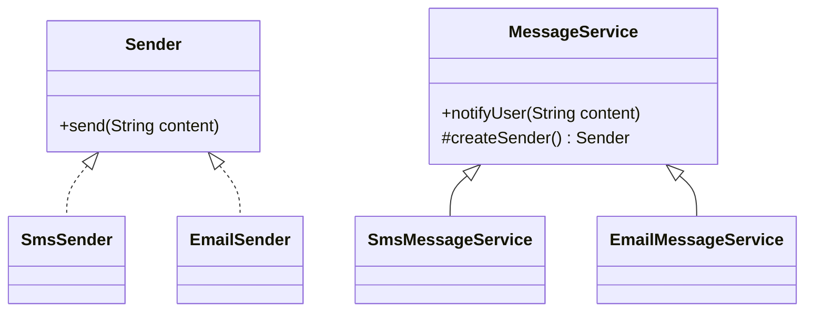

# 工厂方法模式（创建型）

## 一句话总结
把“创建产品”的职责交给子类，通过工厂方法延迟具体对象的实例化，扩展时不改已有代码。

---

## 问题与场景
- 同一类业务对象有多种实现（如短信/邮件/站内信），但创建逻辑各不相同。
- 新增实现频繁，希望新增时不改动核心流程代码。
- 需要把“使用对象”和“创建对象”解耦，避免在业务方法里到处 `new`。

---

## 模式意图
**定义一个用于创建对象的接口/抽象方法，让子类决定实例化哪一个类**，把对象创建延迟到子类。

---

## 结构图


---

## 角色与职责
- Product（Sender）：产品接口，定义能力（发送消息）。
- ConcreteProduct（SmsSender/EmailSender）：具体产品实现。
- Creator（MessageService）：定义工厂方法 `createSender()`，并在业务方法中使用产品。
- ConcreteCreator（SmsMessageService/EmailMessageService）：决定创建哪种产品。

---

## 协作流程
1. Client 选择具体工厂（某个 `MessageService` 子类）。
2. 业务方法 `notifyUser` 调用工厂方法创建产品。
3. 产品完成发送动作。
4. 扩展新渠道时新增产品与工厂子类即可。

---

## 真实业务示例：订单状态变更通知
场景：订单状态变更需要通知用户，但不同业务线要求不同通知渠道（短信/邮件/站内信）。

怎么用：
- 把“通知发送器”抽象成 `Sender`，业务服务只依赖抽象。
- 每条业务线选择自己的 `MessageService` 子类，工厂方法返回对应渠道的 Sender。

为什么这样用：
- 渠道选择差异属于创建差异，放在子类更清晰。
- 核心流程无需修改，新增渠道只新增类。

带来的收益：
- 通知渠道可插拔，扩展成本低。
- 创建逻辑集中管理，避免到处散落 `new`。

---

## 代码示例（Java）
```java
public class FactoryMethodDemo {
    public static void main(String[] args) {
        MessageService smsService = new SmsMessageService();
        MessageService emailService = new EmailMessageService();

        smsService.notifyUser("订单已支付");
        emailService.notifyUser("订单已发货");
    }

    // 产品接口
    interface Sender {
        void send(String content);
    }

    // 具体产品
    static class SmsSender implements Sender {
        public void send(String content) {
            System.out.println("短信发送：" + content);
        }
    }

    static class EmailSender implements Sender {
        public void send(String content) {
            System.out.println("邮件发送：" + content);
        }
    }

    // 创建者：业务流程依赖抽象产品
    static abstract class MessageService {
        public void notifyUser(String content) {
            Sender sender = createSender();
            sender.send(content);
        }

        // 工厂方法：由子类决定具体产品
        protected abstract Sender createSender();
    }

    // 具体创建者
    static class SmsMessageService extends MessageService {
        protected Sender createSender() {
            return new SmsSender();
        }
    }

    static class EmailMessageService extends MessageService {
        protected Sender createSender() {
            return new EmailSender();
        }
    }
}
```

关键点说明：
- `MessageService` 只依赖 `Sender` 接口，不关心具体实现。
- `createSender()` 是变化点，放在子类中扩展。
- 业务方法 `notifyUser` 保持稳定，扩展时无需修改。

---

## 优缺点
优点：
- 解耦创建与使用，减少业务代码中的分支与 `new`。
- 对扩展友好，新增产品只需新增子类。
- 便于测试，可替换不同具体工厂进行验证。

缺点：
- 类数量增多，简单场景可能显得“重”。
- 产品族扩展会导致更多子类管理成本。

---

## 适用/不适用
适用：
- 创建逻辑有差异，需要子类决定实例化类型。
- 需要把创建细节隐藏在子类中，保证上层流程稳定。

不适用：
- 产品非常少且变化极低，直接构造更简单。
- 只需要简单的参数选择分支（可用简单工厂/策略）。

---

## 常见误区
- 把“对象选择”写回业务方法，导致工厂方法形同虚设。
- 工厂方法里混入业务逻辑，违反单一职责。
- 为了扩展过度拆分，造成类爆炸。

---

## 相关模式
- 简单工厂：由一个工厂通过参数选择产品；工厂方法是通过子类决定产品。
- 抽象工厂：创建“产品族”；工厂方法是创建“单一产品”。
- 策略模式：关注行为切换；工厂方法关注对象创建。

---

## 小结
- 工厂方法把创建延迟到子类，核心流程保持稳定。
- 适合“产品类型会扩展”的场景。
- 通过抽象产品接口降低耦合。
- 注意控制类数量，避免过度设计。
