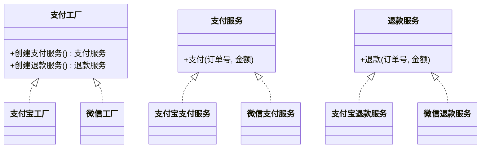

# 抽象工厂模式（创建型）

## 一句话总结
提供创建“产品族”的统一入口，让具体工厂决定整套产品的实现，避免混用导致的不一致。

---

## 问题与场景
- 系统需要支持多套“相关产品组合”（如不同支付渠道的支付+退款）。
- 业务流程必须成套切换，不能把 A 渠道的支付和 B 渠道的退款混在一起。
- 新增一整套能力时，希望最小化对现有流程的修改。

---

## 模式意图
**为创建一系列相关或相互依赖的对象提供一个接口，而无需指定它们的具体类**，保证产品族的一致性。

---

## 结构图


---

## 角色与职责
- 抽象工厂（支付工厂）：定义创建一整套产品的方法。
- 具体工厂（支付宝工厂/微信工厂）：生产具体产品族。
- 抽象产品（支付服务/退款服务）：定义产品能力接口。
- 具体产品（支付宝支付服务 等）：具体产品实现。
- 客户端（结算服务）：只依赖抽象工厂与抽象产品。

---

## 协作流程
1. 客户端 根据配置选择具体工厂（如支付宝/微信）。
2. 客户端 通过工厂创建同一产品族的支付与退款服务。
3. 业务流程只使用抽象产品接口完成支付/退款。
4. 更换渠道时替换工厂即可，新增渠道新增工厂与产品族。

---

## 真实业务示例：多支付渠道的“支付+退款”产品族
场景：电商平台同时接入支付宝与微信，支付和退款必须在同一渠道完成，不能错配。

怎么用：
- 为每个渠道提供一个 `支付工厂` 实现，生成该渠道的支付与退款服务。
- 订单结算服务只持有工厂与抽象产品，不依赖具体渠道类。

为什么这样用：
- “支付+退款”是成套能力，抽象工厂能保证产品族一致性。
- 切换渠道只需替换工厂，业务流程无需改动。

带来的收益：
- 避免渠道错配带来的资金与对账风险。
- 新增渠道时改动面小，集成成本可控。

---

## 代码示例（Java）
```java
public class AbstractFactoryDemo {
    public static void main(String[] args) {
        PaymentFactory aliFactory = new AliPayFactory();
        CheckoutService aliCheckout = new CheckoutService(aliFactory);
        aliCheckout.pay("O1001", 199);
        aliCheckout.refund("O1001", 50);

        PaymentFactory wechatFactory = new WechatPayFactory();
        CheckoutService wechatCheckout = new CheckoutService(wechatFactory);
        wechatCheckout.pay("O1002", 299);
    }

    // 抽象产品
    interface PayService {
        void pay(String orderId, int amount);
    }

    interface RefundService {
        void refund(String orderId, int amount);
    }

    // 抽象工厂
    interface PaymentFactory {
        PayService createPayService();
        RefundService createRefundService();
    }

    // 具体产品：支付宝
    static class AliPayPayService implements PayService {
        public void pay(String orderId, int amount) {
            System.out.println("支付宝支付：" + orderId + "，金额=" + amount);
        }
    }

    static class AliPayRefundService implements RefundService {
        public void refund(String orderId, int amount) {
            System.out.println("支付宝退款：" + orderId + "，金额=" + amount);
        }
    }

    // 具体产品：微信
    static class WechatPayService implements PayService {
        public void pay(String orderId, int amount) {
            System.out.println("微信支付：" + orderId + "，金额=" + amount);
        }
    }

    static class WechatRefundService implements RefundService {
        public void refund(String orderId, int amount) {
            System.out.println("微信退款：" + orderId + "，金额=" + amount);
        }
    }

    // 具体工厂
    static class AliPayFactory implements PaymentFactory {
        public PayService createPayService() {
            return new AliPayPayService();
        }

        public RefundService createRefundService() {
            return new AliPayRefundService();
        }
    }

    static class WechatPayFactory implements PaymentFactory {
        public PayService createPayService() {
            return new WechatPayService();
        }

        public RefundService createRefundService() {
            return new WechatRefundService();
        }
    }

    // 业务流程只依赖抽象工厂与抽象产品
    static class CheckoutService {
        private final PayService payService;
        private final RefundService refundService;

        CheckoutService(PaymentFactory factory) {
            this.payService = factory.createPayService();
            this.refundService = factory.createRefundService();
        }

        void pay(String orderId, int amount) {
            payService.pay(orderId, amount);
        }

        void refund(String orderId, int amount) {
            refundService.refund(orderId, amount);
        }
    }
}
```

关键点说明：
- `结算服务` 只依赖抽象工厂与抽象产品，流程稳定。
- 具体渠道通过工厂创建成套产品，避免错配。
- 新增渠道只需新增具体工厂与产品实现。

---

## 优缺点
优点：
- 保证同一产品族的一致性，避免组合错配。
- 隔离具体类依赖，切换产品族成本低。
- 便于扩展新产品族，符合开闭原则。

缺点：
- 新增“产品种类”需要修改所有工厂接口与实现。
- 类数量增多，结构更复杂。

---

## 适用/不适用
适用：
- 系统需要成套切换多产品族，且产品间有强一致性要求。
- 需要在运行时选择不同产品族（配置/租户/环境）。

不适用：
- 只有单一产品，或不存在产品族的一致性要求。
- 产品种类经常变化（频繁加新产品种类），维护成本过高。

---

## 常见误区
- 把“产品族切换”当成“单个产品选择”，导致设计过重。
- 客户端绕开工厂直接 `new`，破坏一致性。
- 工厂里混入业务流程，职责不清。
- 产品种类不稳定却使用抽象工厂，后期改动范围大。

---

## 相关模式
- 工厂方法模式：抽象工厂内部常用工厂方法创建具体产品。
- 简单工厂：适合单一产品的创建选择，不强调产品族。
- 建造者模式：关注复杂对象的分步骤构建，不是产品族切换。

---

## 小结
- 抽象工厂用于创建“相关产品族”，强调一致性。
- 客户端只依赖抽象接口，业务流程更稳定。
- 新增产品族扩展方便，但新增产品种类成本高。
- 适合多渠道、多租户等需要成套切换的场景。
