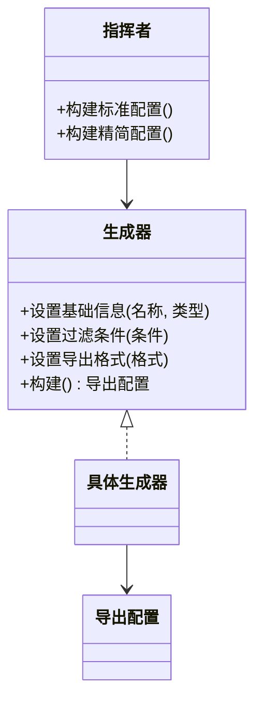

# 生成器模式（创建型）

## 一句话总结
把复杂对象的构建过程拆成稳定步骤，通过生成器逐步组装，既能复用流程又能产出不同配置。

---

## 问题与场景
- 需要创建“参数多、组合多、可选项多”的复杂对象（如订单导出配置）。
- 构建流程固定，但最终配置组合经常变化。
- 想避免在构造函数里塞一堆可选参数，导致可读性差。

---

## 模式意图
**将一个复杂对象的构建与其表示分离**，使同样的构建过程可以创建不同的表示。

---

## 结构图


---

## 角色与职责
- 生成器（导出配置生成器）：定义构建步骤与返回结果。
- 具体生成器（默认导出配置生成器）：实现各步骤并组装对象。
- 指挥者（导出配置指挥者）：负责固定的构建流程编排。
- 产品（导出配置）：最终被构建的复杂对象。
- 客户端：选择生成器或指挥者并获取结果。

---

## 协作流程
1. 客户端 创建具体生成器。
2. 客户端 选择是否交给指挥者编排流程。
3. 生成器逐步设置属性并构建产品。
4. 客户端 获取最终产品。

---

## 真实业务示例：订单导出配置的多版本构建
场景：运营需要导出订单报表，但不同角色需要不同字段、过滤条件与导出格式。

怎么用：
- 用生成器封装“字段选择、过滤条件、格式设置”的构建步骤。
- 指挥者提供“标准版/精简版/财务版”等固定组合。

为什么这样用：
- 构建步骤稳定，差异只在具体配置组合。
- 避免构造函数参数爆炸，阅读与维护更清晰。

带来的收益：
- 构建流程可复用，新增版本只需新增指挥者方法或策略。
- 复杂配置可读性强，减少误配。

---

## 代码示例（Java）
```java
import java.util.ArrayList;
import java.util.List;

public class BuilderDemo {
    public static void main(String[] args) {
        ExportConfigBuilder builder = new DefaultExportConfigBuilder();
        ExportConfigDirector director = new ExportConfigDirector(builder);

        ExportConfig standard = director.buildStandard();
        ExportConfig compact = director.buildCompact();

        System.out.println(standard);
        System.out.println(compact);
    }

    // 产品
    static class ExportConfig {
        private String name;
        private String type;
        private List<String> fields = new ArrayList<>();
        private String filter;
        private String format;

        public void setName(String name) {
            this.name = name;
        }

        public void setType(String type) {
            this.type = type;
        }

        public void setFields(List<String> fields) {
            this.fields = fields;
        }

        public void setFilter(String filter) {
            this.filter = filter;
        }

        public void setFormat(String format) {
            this.format = format;
        }

        public String toString() {
            return "ExportConfig{name='" + name + "', type='" + type + "', fields=" + fields
                + ", filter='" + filter + "', format='" + format + "'}";
        }
    }

    // 生成器接口
    interface ExportConfigBuilder {
        ExportConfigBuilder base(String name, String type);
        ExportConfigBuilder fields(List<String> fields);
        ExportConfigBuilder filter(String filter);
        ExportConfigBuilder format(String format);
        ExportConfig build();
    }

    // 具体生成器
    static class DefaultExportConfigBuilder implements ExportConfigBuilder {
        private final ExportConfig config = new ExportConfig();

        public ExportConfigBuilder base(String name, String type) {
            config.setName(name);
            config.setType(type);
            return this;
        }

        public ExportConfigBuilder fields(List<String> fields) {
            config.setFields(fields);
            return this;
        }

        public ExportConfigBuilder filter(String filter) {
            config.setFilter(filter);
            return this;
        }

        public ExportConfigBuilder format(String format) {
            config.setFormat(format);
            return this;
        }

        public ExportConfig build() {
            return config;
        }
    }

    // 指挥者：封装构建流程
    static class ExportConfigDirector {
        private final ExportConfigBuilder builder;

        ExportConfigDirector(ExportConfigBuilder builder) {
            this.builder = builder;
        }

        ExportConfig buildStandard() {
            return builder
                .base("订单导出", "订单")
                .fields(List.of("订单号", "用户", "金额", "状态", "创建时间"))
                .filter("近30天")
                .format("CSV")
                .build();
        }

        ExportConfig buildCompact() {
            return builder
                .base("订单导出-精简", "订单")
                .fields(List.of("订单号", "金额"))
                .filter("近7天")
                .format("CSV")
                .build();
        }
    }
}
```

关键点说明：
- 生成器把复杂构建过程分解为多个步骤，避免构造函数过长。
- 指挥者封装固定流程，保证“版本”之间的一致性。
- 客户端可选择指挥者或自行调用生成器实现自定义配置。

---

## 优缺点
优点：
- 构建过程清晰，可复用、可扩展。
- 避免构造函数参数过多，提高可读性。
- 支持不同表示的快速切换。

缺点：
- 类数量增加，结构复杂度上升。
- 如果产品结构频繁变化，需要调整生成器接口与实现。

---

## 适用/不适用
适用：
- 复杂对象需要分步骤创建，且步骤相对稳定。
- 同一构建流程需要产出多种组合配置。

不适用：
- 对象非常简单，直接构造更直观。
- 构建步骤高度动态且不可复用。

---

## 常见误区
- 把生成器当作“万能配置器”，导致接口过度膨胀。
- 指挥者包含业务逻辑而非构建流程，职责混乱。
- 生成器复用同一实例未重置，导致脏数据串联。

---

## 相关模式
- 工厂方法模式：用于创建单一产品，生成器用于分步骤构建。
- 抽象工厂模式：关注产品族一致性，生成器关注构建过程。
- 原型模式：通过复制已有对象获得新实例。

---

## 小结
- 生成器适合“复杂对象的分步骤构建”。
- 指挥者可复用流程，减少重复组装代码。
- 新增配置组合简单，但产品变化会牵动生成器接口。
- 控制生成器职责范围，避免接口膨胀。
