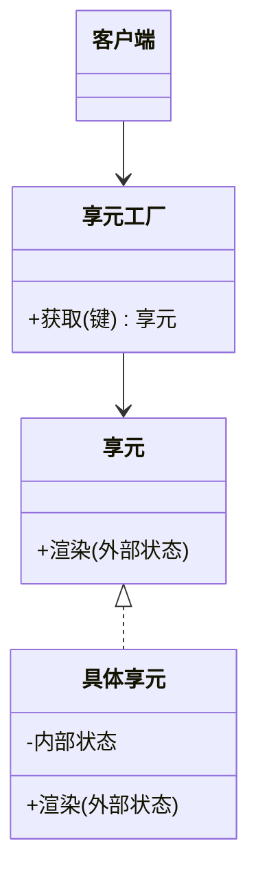

# 享元模式（结构型）

## 一句话总结
通过共享不可变的内部状态来复用对象，显著降低内存与创建成本。

---

## 问题与场景
- 需要创建大量相似对象，内存占用高。
- 对象大部分状态可共享，只有少量状态不同。
- 希望减少对象创建频率，提高性能。

---

## 模式意图
**运用共享技术有效地支持大量细粒度对象**，把可共享的内部状态提取出来复用。

---

## 结构图


---

## 角色与职责
- 享元（图标）：共享对象接口。
- 具体享元（缓存图标）：保存内部状态并复用。
- 享元工厂（图标工厂）：缓存并管理享元对象。
- 客户端：传入外部状态并使用享元。

---

## 协作流程
1. 客户端 向工厂请求享元。
2. 工厂 从缓存返回已有对象或创建新对象。
3. 客户端 传入外部状态进行使用。

---

## 真实业务示例：列表图标渲染复用
场景：商品列表有大量相同类型图标（热销、包邮），重复创建浪费内存。

怎么用：
- 图标样式作为内部状态缓存。
- 位置信息与商品 ID 作为外部状态传入。

为什么这样用：
- 图标外观相同，可共享。
- 外部位置不同，通过参数传入即可。

带来的收益：
- 显著降低对象数量与内存占用。
- 提升渲染性能。

---

## 代码示例（Java）
```java
import java.util.HashMap;
import java.util.Map;

public class FlyweightDemo {
    public static void main(String[] args) {
        IconFactory factory = new IconFactory();

        Icon hot1 = factory.get("hot");
        Icon hot2 = factory.get("hot");

        hot1.render(1, 1);
        hot2.render(2, 3);
        System.out.println(hot1 == hot2);
    }

    interface Icon {
        void render(int x, int y);
    }

    static class CachedIcon implements Icon {
        private final String style; // 内部状态

        CachedIcon(String style) {
            this.style = style;
        }

        public void render(int x, int y) {
            System.out.println("渲染" + style + "图标 at (" + x + "," + y + ")");
        }
    }

    static class IconFactory {
        private final Map<String, Icon> cache = new HashMap<>();

        Icon get(String key) {
            return cache.computeIfAbsent(key, CachedIcon::new);
        }
    }
}
```

关键点说明：
- 内部状态应尽量不可变且可共享。
- 外部状态由客户端传入，避免共享污染。

---

## 优缺点
优点：
- 共享对象，显著节省内存。
- 降低对象创建开销。

缺点：
- 需要区分内部/外部状态，设计复杂。
- 不当共享会导致状态污染。

---

## 适用/不适用
适用：
- 大量细粒度对象且大部分状态可共享。
- 内存压力大、对象创建频繁。

不适用：
- 对象状态大多不可共享。
- 对象数量不多，优化收益不足。

---

## 常见误区
- 把可变状态放入共享对象，导致串数据。
- 缓存无限增长，缺少清理策略。
- 误用享元导致可读性下降。

---

## 相关模式
- 原型模式：原型是复制，享元是共享。
- 组合模式：组合组织结构，享元优化对象数量。
- 单例模式：单例是“唯一”，享元是“共享多个”。

---

## 小结
- 享元通过共享减少对象数量与内存。
- 关键在区分内部状态与外部状态。
- 适合大量相似对象的场景。
- 注意缓存策略与共享边界。
