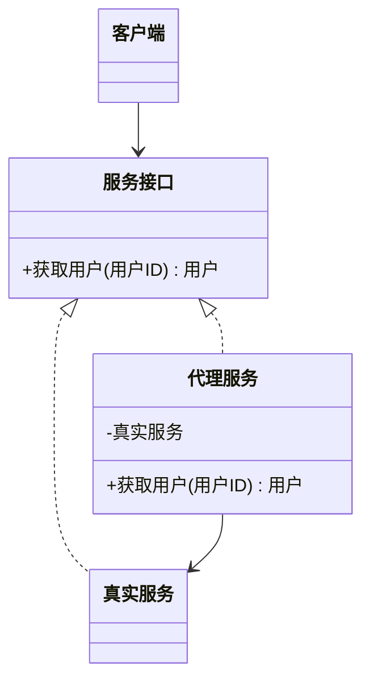

# 代理模式（结构型）

## 一句话总结
为目标对象提供一个替身，以控制访问、增强功能或隔离资源。

---

## 问题与场景
- 需要在访问目标对象前后做额外处理（鉴权、缓存、日志）。
- 目标对象创建成本高，想延迟创建或复用。
- 需要隔离远程调用或复杂资源。

---

## 模式意图
**为其他对象提供一种代理以控制对这个对象的访问**，在不改变目标对象的情况下增强能力。

---

## 结构图


---

## 角色与职责
- 抽象主题（用户服务）：定义服务接口。
- 真实主题（真实用户服务）：真正执行业务逻辑。
- 代理（用户服务代理）：控制访问并增强能力。
- 客户端：通过接口使用服务。

---

## 协作流程
1. 客户端 调用代理。
2. 代理 执行前置逻辑（鉴权/缓存/限流）。
3. 代理 调用真实对象完成业务。
4. 代理 执行后置逻辑并返回。

---

## 真实业务示例：用户信息缓存代理
场景：查询用户信息成本高，且访问频繁，需要加缓存。

怎么用：
- 真实服务只负责查询数据库。
- 代理服务先查缓存，未命中再调用真实服务并写缓存。

为什么这样用：
- 缓存逻辑与业务逻辑分离。
- 不改动真实服务，风险更低。

带来的收益：
- 降低数据库压力。
- 访问性能显著提升。

---

## 代码示例（Java）
```java
import java.util.HashMap;
import java.util.Map;

public class ProxyDemo {
    public static void main(String[] args) {
        UserService service = new UserServiceProxy(new RealUserService());
        System.out.println(service.getUser("u-1"));
        System.out.println(service.getUser("u-1"));
    }

    interface UserService {
        String getUser(String userId);
    }

    static class RealUserService implements UserService {
        public String getUser(String userId) {
            return "用户信息:" + userId;
        }
    }

    static class UserServiceProxy implements UserService {
        private final UserService real;
        private final Map<String, String> cache = new HashMap<>();

        UserServiceProxy(UserService real) {
            this.real = real;
        }

        public String getUser(String userId) {
            if (cache.containsKey(userId)) {
                return "[缓存]" + cache.get(userId);
            }
            String result = real.getUser(userId);
            cache.put(userId, result);
            return result;
        }
    }
}
```

关键点说明：
- 代理与真实对象实现同一接口，客户端无感知。
- 代理适合做访问控制、缓存、日志、延迟加载。

---

## 优缺点
优点：
- 控制访问，增强能力。
- 不侵入真实对象。
- 支持延迟创建与资源隔离。

缺点：
- 代理过多时结构复杂。
- 可能引入额外性能开销。

---

## 适用/不适用
适用：
- 需要访问控制或缓存。
- 远程服务或重资源对象。

不适用：
- 逻辑非常简单，直接调用即可。
- 代理层可能导致调试困难。

---

## 常见误区
- 代理承担过多业务逻辑，导致职责混乱。
- 代理链过深，调用开销过大。
- 忘记处理缓存一致性。

---

## 相关模式
- 装饰器模式：装饰器增强功能，代理强调控制访问。
- 外观模式：外观对外简化，代理对对象访问做控制。
- 适配器模式：适配器解决接口不兼容。

---

## 小结
- 代理用于控制访问与增强能力。
- 适合缓存、鉴权、远程调用等场景。
- 代理与真实对象实现同一接口。
- 注意代理层的复杂度与性能。
