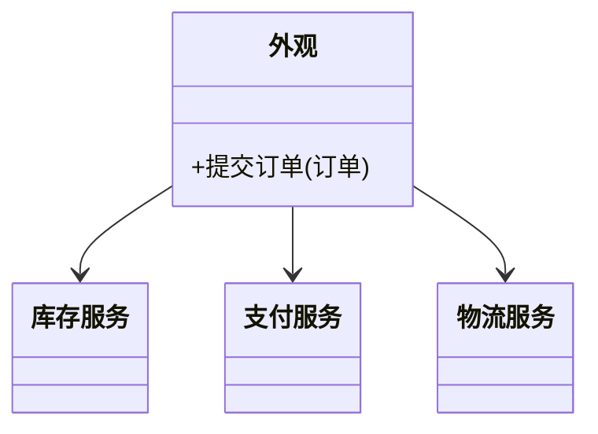

# 外观模式（结构型）

## 一句话总结
用一个统一入口封装复杂子系统，简化调用方的使用成本。

---

## 问题与场景
- 子系统接口复杂、调用顺序繁琐，客户端容易出错。
- 多个模块强依赖，调用方需要了解太多细节。
- 希望对外提供“简单、稳定”的统一入口。

---

## 模式意图
**为子系统的一组接口提供一个统一的高层接口**，使子系统更易使用。

---

## 结构图


---

## 角色与职责
- 外观（订单外观）：对外统一入口，编排子系统调用。
- 子系统（InventoryService/PaymentService/ShippingService）：各自完成职责。
- 客户端：只依赖外观，不直接访问子系统。

---

## 协作流程
1. 客户端 调用外观方法。
2. 外观 依次调用子系统完成流程。
3. 外观 汇总结果返回。

---

## 真实业务示例：下单流程封装
场景：下单需要锁库存、支付扣款、创建物流单，调用顺序严格。

怎么用：
- 外观对外暴露 `placeOrder`，内部编排库存、支付、物流。
- 客户端只需调用一个方法。

为什么这样用：
- 调用顺序复杂，集中在外观更可靠。
- 子系统可独立演进，对外接口保持稳定。

带来的收益：
- 降低调用方复杂度。
- 统一入口便于监控与灰度。

---

## 代码示例（Java）
```java
public class FacadeDemo {
    public static void main(String[] args) {
        OrderFacade facade = new OrderFacade(
            new InventoryService(),
            new PaymentService(),
            new ShippingService()
        );
        facade.placeOrder("O1001");
    }

    static class OrderFacade {
        private final InventoryService inventory;
        private final PaymentService payment;
        private final ShippingService shipping;

        OrderFacade(InventoryService inventory, PaymentService payment, ShippingService shipping) {
            this.inventory = inventory;
            this.payment = payment;
            this.shipping = shipping;
        }

        void placeOrder(String orderId) {
            inventory.reserve(orderId);
            payment.pay(orderId);
            shipping.create(orderId);
            System.out.println("下单完成：" + orderId);
        }
    }

    static class InventoryService {
        void reserve(String orderId) {
            System.out.println("锁库存：" + orderId);
        }
    }

    static class PaymentService {
        void pay(String orderId) {
            System.out.println("支付成功：" + orderId);
        }
    }

    static class ShippingService {
        void create(String orderId) {
            System.out.println("创建物流单：" + orderId);
        }
    }
}
```

关键点说明：
- 外观只负责编排，不替代子系统。
- 子系统接口仍可被其他模块直接使用（可选）。

---

## 优缺点
优点：
- 简化调用方，降低学习成本。
- 降低耦合，子系统内部可自由演进。
- 统一入口便于治理。

缺点：
- 外观可能变得过重。
- 可能掩盖子系统的复杂性。

---

## 适用/不适用
适用：
- 子系统复杂，需要简化入口。
- 需要稳定对外接口。

不适用：
- 子系统简单，外观多余。
- 需要细粒度控制子系统调用顺序。

---

## 常见误区
- 把业务逻辑堆进外观，导致“上帝类”。
- 外观与子系统过度耦合，失去封装意义。
- 忽视子系统接口的版本管理。

---

## 相关模式
- 中介者模式：中介者负责对象间协作，外观负责对外简化。
- 适配器模式：适配器解决接口不兼容，外观解决使用复杂。
- 桥接模式：桥接分离维度，外观提供统一入口。

---

## 小结
- 外观提供统一入口，简化调用方。
- 子系统可独立演进，对外稳定。
- 外观应保持轻薄，不承载业务逻辑。
- 适合下单、启动流程等复杂编排场景。
