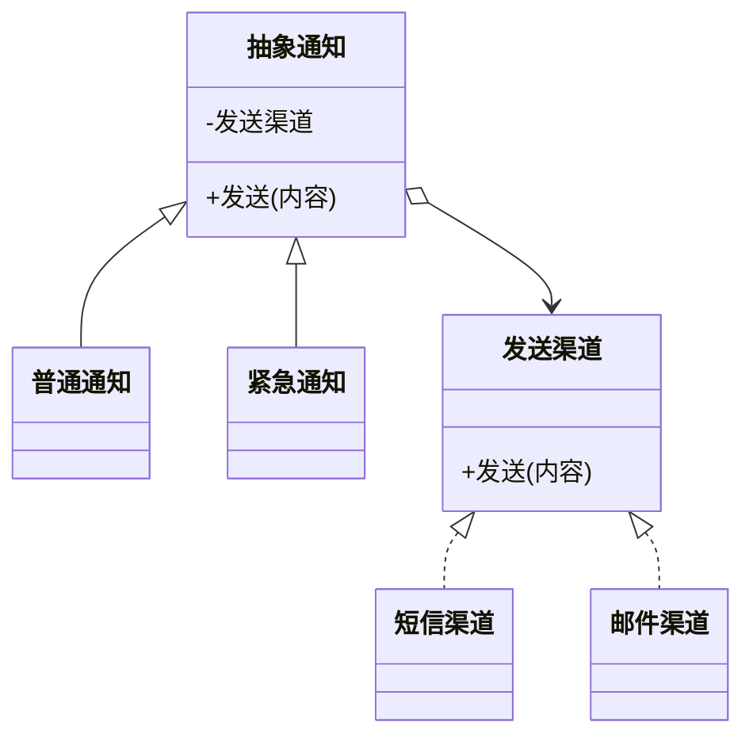

# 桥接模式（结构型）

## 一句话总结
把“抽象维度”和“实现维度”分离，通过组合桥接，避免类爆炸并支持独立扩展。

---

## 问题与场景
- 同一业务存在两个变化维度，组合后类数量急剧增长。
- 抽象和实现都在变化，继承层次难以维护。
- 需要在不改动既有代码的前提下扩展其中一个维度。

---

## 模式意图
**将抽象部分与实现部分分离，使它们都可以独立变化**，通过组合连接两者。

---

## 结构图


---

## 角色与职责
- 抽象（通知）：对外暴露统一的通知行为。
- 精化抽象（普通通知/紧急通知）：扩展抽象行为。
- 实现（发送渠道）：定义底层发送能力。
- 具体实现（短信渠道/邮件渠道）：不同发送方式的实现。
- 客户端：组合不同通知类型与渠道。

---

## 协作流程
1. 客户端 选择通知类型与发送渠道。
2. 抽象通知 持有发送渠道引用。
3. 调用通知方法时，抽象通知委派给发送渠道。
4. 更换通知类型或渠道只需替换对应对象。

---

## 真实业务示例：多级告警与多渠道发送
场景：告警分为“普通/紧急”两级，同时支持短信、邮件、企业微信等渠道。

怎么用：
- 把“通知类型”作为抽象层，定义不同级别的通知逻辑。
- 把“发送渠道”作为实现层，独立扩展发送方式。

为什么这样用：
- 两个维度变化频繁，桥接能避免“级别 × 渠道”的类爆炸。
- 任意组合都可用，扩展成本低。

带来的收益：
- 抽象与实现解耦，维护更清晰。
- 新增渠道或通知级别不互相影响。

---

## 代码示例（Java）
```java
public class BridgeDemo {
    public static void main(String[] args) {
        Notification normalSms = new NormalNotification(new SmsSender());
        Notification urgentMail = new UrgentNotification(new EmailSender());

        normalSms.send("库存不足");
        urgentMail.send("支付超时");
    }

    // 实现层：发送渠道
    interface Sender {
        void send(String content);
    }

    static class SmsSender implements Sender {
        public void send(String content) {
            System.out.println("短信：" + content);
        }
    }

    static class EmailSender implements Sender {
        public void send(String content) {
            System.out.println("邮件：" + content);
        }
    }

    // 抽象层：通知
    static abstract class Notification {
        protected final Sender sender;

        protected Notification(Sender sender) {
            this.sender = sender;
        }

        abstract void send(String content);
    }

    // 精化抽象：普通通知
    static class NormalNotification extends Notification {
        NormalNotification(Sender sender) {
            super(sender);
        }

        void send(String content) {
            sender.send("【普通】" + content);
        }
    }

    // 精化抽象：紧急通知
    static class UrgentNotification extends Notification {
        UrgentNotification(Sender sender) {
            super(sender);
        }

        void send(String content) {
            sender.send("【紧急】" + content);
        }
    }
}
```

关键点说明：
- 抽象层持有实现层引用，通过组合完成桥接。
- 新增通知级别或新渠道只需新增对应类，不会影响另一维度。

---

## 优缺点
优点：
- 抽象与实现解耦，可独立扩展。
- 避免子类爆炸，组合更灵活。
- 提升可测试性与可维护性。

缺点：
- 结构更复杂，初期理解成本较高。
- 小规模场景可能显得过度设计。

---

## 适用/不适用
适用：
- 存在两个及以上变化维度，需要独立扩展。
- 组合数量可能爆炸，继承层次难维护。

不适用：
- 变化维度单一或很稳定。
- 系统规模小，直接继承更简单。

---

## 常见误区
- 把桥接当成简单的“适配器”，混淆职责。
- 抽象层依赖具体实现，破坏解耦目标。
- 维度未拆清，导致桥接层职责混乱。

---

## 相关模式
- 适配器模式：适配器解决接口不兼容，桥接解决维度解耦。
- 装饰器模式：装饰器增强功能，桥接组合两条独立变化线。
- 外观模式：外观是对外统一入口，桥接是内部结构解耦。

---

## 小结
- 桥接用于拆分“抽象”和“实现”两个变化维度。
- 通过组合连接两者，避免类爆炸。
- 新增维度时独立扩展，降低改动范围。
- 小场景慎用，确保收益覆盖复杂度。
