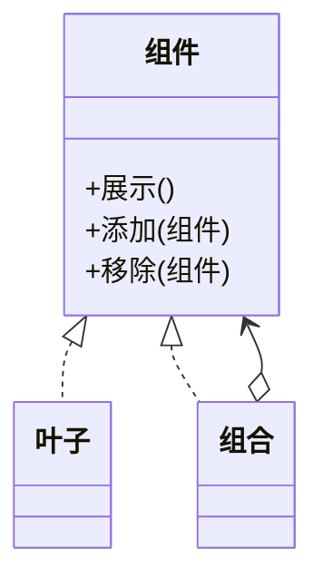

# 组合模式（结构型）

## 一句话总结
把“部分-整体”的层级结构组织成树形，让客户端用一致方式处理叶子与组合节点。

---

## 问题与场景
- 需要表达树形结构（如菜单、组织架构、权限）。
- 想让调用方统一处理“单个对象”和“对象集合”。
- 需要对整棵树执行统一操作（遍历、统计、渲染）。

---

## 模式意图
**将对象组合成树形结构以表示“部分-整体”的层次结构**，使客户端对单个对象和组合对象的使用具有一致性。

---

## 结构图


---

## 角色与职责
- 组件（菜单组件）：定义统一接口。
- 叶子（菜单项）：树的叶子节点。
- 组合（菜单组）：包含子节点并实现组合逻辑。
- 客户端：通过组件接口统一操作。

---

## 协作流程
1. 客户端 组装树形结构。
2. 客户端 调用组件统一方法。
3. 组合节点递归调用子节点。
4. 叶子节点执行具体动作。

---

## 真实业务示例：权限菜单树渲染
场景：系统菜单有多级结构，既要显示目录又要显示具体页面。

怎么用：
- 目录作为组合节点，页面作为叶子节点。
- 渲染时对根节点调用 `render()`，递归输出。

为什么这样用：
- 调用方无需区分目录或页面类型。
- 结构清晰，扩展节点类型方便。

带来的收益：
- 统一处理树形结构，减少分支判断。
- 便于统计、授权、渲染等统一操作。

---

## 代码示例（Java）
```java
import java.util.ArrayList;
import java.util.List;

public class CompositeDemo {
    public static void main(String[] args) {
        MenuGroup root = new MenuGroup("系统管理");
        root.add(new MenuItem("用户管理"));
        root.add(new MenuItem("角色管理"));

        MenuGroup report = new MenuGroup("报表");
        report.add(new MenuItem("日报"));
        report.add(new MenuItem("月报"));

        root.add(report);
        root.display(0);
    }

    interface MenuComponent {
        void display(int level);
        default void add(MenuComponent component) {
            throw new UnsupportedOperationException();
        }
        default void remove(MenuComponent component) {
            throw new UnsupportedOperationException();
        }
    }

    static class MenuItem implements MenuComponent {
        private final String name;

        MenuItem(String name) {
            this.name = name;
        }

        public void display(int level) {
            System.out.println("  ".repeat(level) + "- " + name);
        }
    }

    static class MenuGroup implements MenuComponent {
        private final String name;
        private final List<MenuComponent> children = new ArrayList<>();

        MenuGroup(String name) {
            this.name = name;
        }

        public void add(MenuComponent component) {
            children.add(component);
        }

        public void remove(MenuComponent component) {
            children.remove(component);
        }

        public void display(int level) {
            System.out.println("  ".repeat(level) + "+ " + name);
            for (MenuComponent child : children) {
                child.display(level + 1);
            }
        }
    }
}
```

关键点说明：
- 组合节点负责递归，叶子节点负责自身行为。
- 统一接口让调用方忽略节点类型差异。

---

## 优缺点
优点：
- 对客户端透明，统一处理叶子与组合对象。
- 结构清晰，易于扩展与维护。

缺点：
- 约束不易，叶子节点也被迫暴露组合操作。
- 结构复杂时调试成本上升。

---

## 适用/不适用
适用：
- 需要表达树形结构。
- 需要统一操作“整体”和“部分”。

不适用：
- 结构不是树形。
- 需要严格区分叶子与组合节点。

---

## 常见误区
- 叶子节点强行实现组合逻辑，导致异常频繁抛出。
- 树过大但缺少懒加载或分页策略。
- 在组合节点中写过多业务逻辑，职责膨胀。

---

## 相关模式
- 迭代器模式：可用于遍历组合结构。
- 访问者模式：可为组合结构添加操作。
- 装饰器模式：装饰器增强单个对象，不涉及树结构。

---

## 小结
- 组合适合树形结构的统一处理。
- 叶子与组合用同一接口，客户端更简单。
- 注意叶子节点的非法操作处理。
- 可配合迭代器/访问者增强能力。
