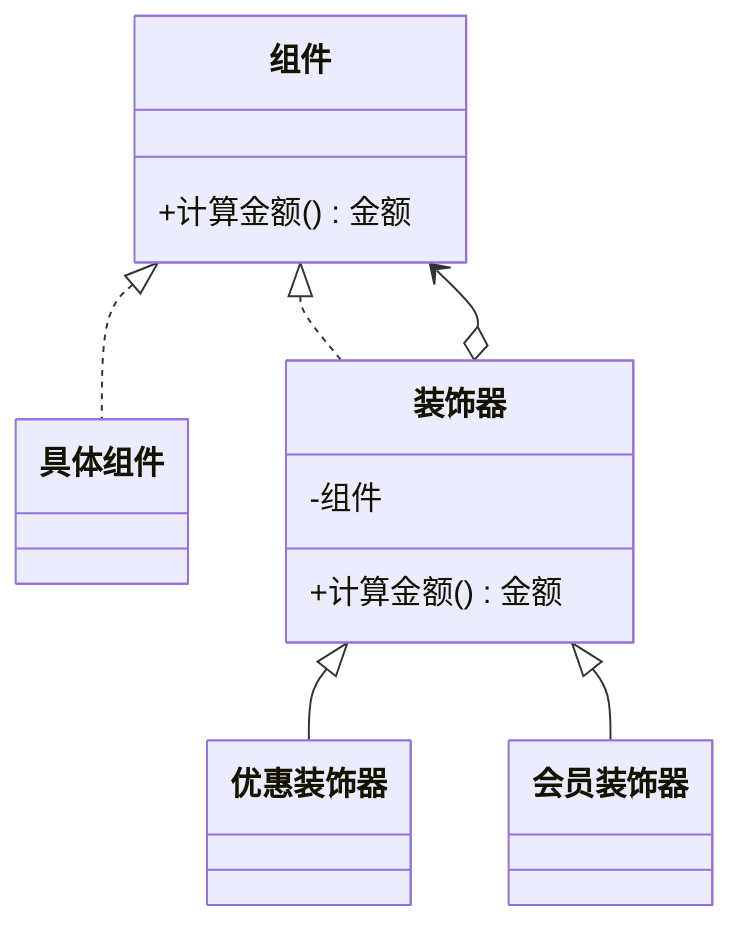

# 装饰器模式（结构型）

## 一句话总结
在不改动原对象的前提下，为对象动态叠加职责，按需组合功能。

---

## 问题与场景
- 功能需要按需组合（如优惠、会员折扣、日志、监控）。
- 使用继承会导致子类组合爆炸，难以维护。
- 希望运行时动态叠加功能，而不是编译期固定。

---

## 模式意图
**动态地给对象添加一些额外职责**，比生成子类更灵活。

---

## 结构图


---

## 角色与职责
- 组件：定义基础能力接口。
- 具体组件：原始对象实现。
- 装饰器：持有组件引用，扩展行为。
- 具体装饰器：实现具体增强逻辑。
- 客户端：按需组合装饰器链。

---

## 协作流程
1. 客户端 创建具体组件。
2. 客户端 按需叠加多个装饰器。
3. 调用组件方法时，调用链逐层执行增强。
4. 最终返回增强后的结果。

---

## 真实业务示例：订单金额的多重优惠
场景：订单金额既可能有优惠券减免，也可能有会员折扣，且组合顺序可配置。

怎么用：
- 基础金额由“原始计算器”提供。
- 优惠券、会员折扣分别用装饰器叠加。

为什么这样用：
- 避免“优惠券+会员+满减”组合导致子类爆炸。
- 组合顺序可调整，适配不同营销规则。

带来的收益：
- 功能可插拔，新增一种优惠只需新增装饰器。
- 组合方式灵活，业务规则更易调整。

---

## 代码示例（Java）
```java
public class DecoratorDemo {
    public static void main(String[] args) {
        PriceCalculator base = new BasePriceCalculator(200);
        PriceCalculator withCoupon = new CouponDecorator(base, 30);
        PriceCalculator withVip = new VipDiscountDecorator(withCoupon, 0.9);

        System.out.println(withVip.calc());
    }

    interface PriceCalculator {
        double calc();
    }

    static class BasePriceCalculator implements PriceCalculator {
        private final double price;

        BasePriceCalculator(double price) {
            this.price = price;
        }

        public double calc() {
            return price;
        }
    }

    static abstract class Decorator implements PriceCalculator {
        protected final PriceCalculator calculator;

        Decorator(PriceCalculator calculator) {
            this.calculator = calculator;
        }
    }

    static class CouponDecorator extends Decorator {
        private final double coupon;

        CouponDecorator(PriceCalculator calculator, double coupon) {
            super(calculator);
            this.coupon = coupon;
        }

        public double calc() {
            return Math.max(0, calculator.calc() - coupon);
        }
    }

    static class VipDiscountDecorator extends Decorator {
        private final double rate;

        VipDiscountDecorator(PriceCalculator calculator, double rate) {
            super(calculator);
            this.rate = rate;
        }

        public double calc() {
            return calculator.calc() * rate;
        }
    }
}
```

关键点说明：
- 装饰器链的顺序会影响最终结果。
- 装饰器只增强职责，不改变基础接口。
- 适合做“可插拔能力”的叠加。

---

## 优缺点
优点：
- 扩展灵活，按需组合。
- 避免继承层次过深。
- 符合开闭原则。

缺点：
- 装饰器过多时调用链变长。
- 组合关系复杂，排查问题成本上升。

---

## 适用/不适用
适用：
- 需要动态叠加功能的场景。
- 组合优于继承的功能扩展。

不适用：
- 功能变化极少，继承更简单。
- 需要严格控制调用顺序且难以配置。

---

## 常见误区
- 把装饰器当作“万能扩展点”，职责过重。
- 装饰器修改基础接口，破坏透明性。
- 装饰器链过长但缺少可视化管理。

---

## 相关模式
- 代理模式：代理强调控制访问，装饰器强调增强功能。
- 适配器模式：适配器是接口转换，装饰器是功能叠加。
- 外观模式：外观是对外简化接口，不涉及功能叠加。

---

## 小结
- 装饰器用于“动态叠加职责”。
- 组合顺序可配置，扩展性强。
- 注意控制装饰器数量与复杂度。
- 适合优惠、日志、监控等可插拔能力。
