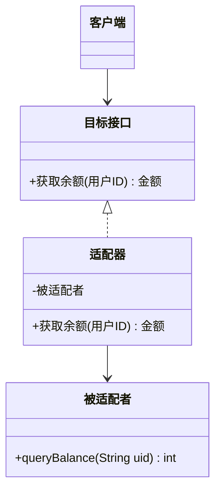

# 适配器模式（结构型）

## 一句话总结
把不兼容的接口“翻译”成业务期望的接口，让旧系统或第三方组件能无缝接入。

---

## 问题与场景
- 业务代码依赖统一接口，但外部系统返回的数据结构不一致。
- 需要复用旧系统能力，但接口与新系统标准不匹配。
- 希望在不改动既有代码的前提下接入第三方。

---

## 模式意图
**将一个类的接口转换成客户端期望的另一个接口**，使原本接口不兼容的类可以协作。

---

## 结构图


---

## 角色与职责
- 目标接口（钱包服务）：客户端期望的统一接口。
- 被适配者（旧钱包接口）：已有接口或第三方组件。
- 适配器（钱包适配器）：把被适配者的能力转换为目标接口。
- 客户端：只依赖目标接口。

---

## 协作流程
1. 客户端 依赖目标接口调用。
2. 适配器 接收调用并转换参数格式。
3. 适配器 调用被适配者。
4. 适配器 转换结果并返回给客户端。

---

## 真实业务示例：对接旧钱包系统
场景：新系统统一用“余额服务”，但旧钱包系统的接口是 `queryBalance(uid)` 且返回单位为“分”。

怎么用：
- 定义新系统的 `WalletService` 接口。
- 用适配器把旧系统返回的“分”转换为“元”。

为什么这样用：
- 旧系统不改代码，降低改造成本与风险。
- 新系统保持统一接口，调用方不需要关注差异。

带来的收益：
- 平滑接入旧系统或第三方。
- 业务层代码稳定，后续替换成本低。

---

## 代码示例（Java）
```java
public class AdapterDemo {
    public static void main(String[] args) {
        WalletService wallet = new WalletAdapter(new LegacyWalletApi());
        System.out.println(wallet.getBalance("u-100"));
    }

    // 目标接口：新系统期望的能力
    interface WalletService {
        String getBalance(String userId);
    }

    // 被适配者：旧系统接口
    static class LegacyWalletApi {
        int queryBalance(String uid) {
            return 12850; // 单位：分
        }
    }

    // 适配器：做参数与单位转换
    static class WalletAdapter implements WalletService {
        private final LegacyWalletApi api;

        WalletAdapter(LegacyWalletApi api) {
            this.api = api;
        }

        public String getBalance(String userId) {
            int cents = api.queryBalance(userId);
            return "余额：" + (cents / 100.0) + " 元";
        }
    }
}
```

关键点说明：
- 适配器只负责“转换”，不引入额外业务逻辑。
- 客户端完全感知不到旧系统接口的存在。

---

## 优缺点
优点：
- 复用旧系统能力，不改原有代码。
- 统一接口，业务层更稳定。
- 适配逻辑集中管理，替换成本低。

缺点：
- 适配器过多可能增加维护成本。
- 接口差异太大时适配成本高。

---

## 适用/不适用
适用：
- 需要接入第三方或旧系统，但接口不兼容。
- 希望统一上层调用接口。

不适用：
- 只需简单参数转换，直接封装方法更简单。
- 需要深度重构系统接口，适配器治标不治本。

---

## 常见误区
- 把业务逻辑写进适配器，导致职责膨胀。
- 适配器层级过深，调用链复杂。
- 没有统一目标接口，导致各处自定义适配。

---

## 相关模式
- 外观模式：外观是对外提供统一入口，适配器是接口转换。
- 桥接模式：桥接分离抽象与实现，适配器连接不兼容接口。
- 装饰器模式：装饰器增强功能，适配器转换接口。

---

## 小结
- 适配器用于“接口不兼容”的集成场景。
- 保持转换职责单一，避免业务逻辑混入。
- 统一目标接口，提升系统可维护性。
- 当接口差异过大时，评估是否需要重构。
