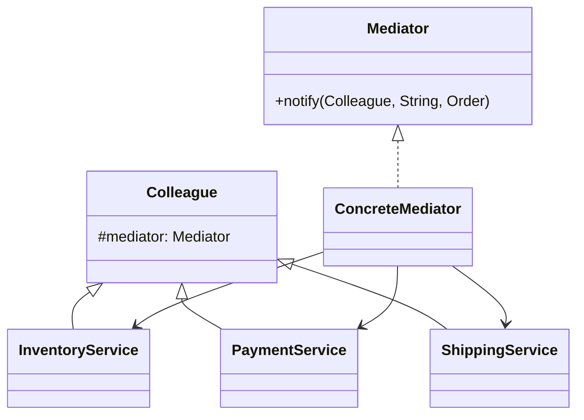

# 中介者模式（行为型）

## 一句话总结
用一个“中介者”集中协调多个对象的交互，避免对象之间的网状依赖。

---

## 问题与场景
- 多个组件相互调用，关系变成“网状”，改一处影响多处。
- 业务流程有清晰的协作顺序，但各模块不该直接依赖对方。
- 需要把“协作规则”集中管理，方便调整与复用。

---

## 模式意图
**用中介者对象封装一系列对象的交互**，使各对象不需要显式地相互引用，从而降低耦合。

---

## 结构图


---

## 角色与职责
- Mediator：定义协调接口，负责转发与编排。
- ConcreteMediator：实现协作规则，控制交互顺序。
- Colleague：业务对象基类，只与中介者通信。
- ConcreteColleague：具体组件，执行自身职责并通知中介者。

---

## 协作流程
1. Client 创建中介者与各组件。
2. 组件只与中介者通信，不直接调用其他组件。
3. 中介者根据事件编排下一步操作。
4. 协作规则变更只需修改中介者。

---

## 真实业务示例：订单履约的协作编排
场景：下单后需要锁库存、扣优惠、支付、发货，各服务之间不希望互相依赖。

怎么用：
- 由“订单履约协调器”作为中介者，统一调度库存/支付/物流。
- 各服务只上报结果给中介者，下一步由中介者决定。

为什么这样用：
- 协作规则集中在一个地方，改流程不必改所有服务。
- 服务之间解耦，彼此无感知，降低联动风险。

带来的收益：
- 协作流程可快速调整与扩展。
- 服务依赖更清晰，测试与排错成本下降。

---

## 代码示例（Java）
```java
public class MediatorDemo {
    public static void main(String[] args) {
        OrderMediator mediator = new OrderMediator();
        InventoryService inventory = new InventoryService(mediator);
        PaymentService payment = new PaymentService(mediator);
        ShippingService shipping = new ShippingService(mediator);

        mediator.register(inventory, payment, shipping);
        mediator.placeOrder(new Order("order-001", 2, 99));
    }

    // 订单对象
    static class Order {
        final String orderId;
        final int amount;
        final int price;
        Order(String orderId, int amount, int price) {
            this.orderId = orderId;
            this.amount = amount;
            this.price = price;
        }
    }

    // 中介者接口
    interface Mediator {
        void notify(Colleague sender, String event, Order order);
    }

    // 同事基类
    static abstract class Colleague {
        protected final Mediator mediator;
        protected Colleague(Mediator mediator) {
            this.mediator = mediator;
        }
    }

    // 具体中介者
    static class OrderMediator implements Mediator {
        private InventoryService inventory;
        private PaymentService payment;
        private ShippingService shipping;

        public void register(InventoryService inventory, PaymentService payment, ShippingService shipping) {
            this.inventory = inventory;
            this.payment = payment;
            this.shipping = shipping;
        }

        public void placeOrder(Order order) {
            inventory.lock(order);
        }

        public void notify(Colleague sender, String event, Order order) {
            if ("STOCK_LOCKED".equals(event)) {
                payment.pay(order);
                return;
            }
            if ("PAY_SUCCESS".equals(event)) {
                shipping.create(order);
                return;
            }
            if ("PAY_FAIL".equals(event)) {
                inventory.release(order);
            }
        }
    }

    // 具体同事：库存
    static class InventoryService extends Colleague {
        InventoryService(Mediator mediator) {
            super(mediator);
        }
        void lock(Order order) {
            System.out.println("锁定库存：" + order.orderId);
            mediator.notify(this, "STOCK_LOCKED", order);
        }
        void release(Order order) {
            System.out.println("释放库存：" + order.orderId);
        }
    }

    // 具体同事：支付
    static class PaymentService extends Colleague {
        PaymentService(Mediator mediator) {
            super(mediator);
        }
        void pay(Order order) {
            boolean ok = order.price <= 100;
            System.out.println("支付结果：" + (ok ? "成功" : "失败"));
            mediator.notify(this, ok ? "PAY_SUCCESS" : "PAY_FAIL", order);
        }
    }

    // 具体同事：物流
    static class ShippingService extends Colleague {
        ShippingService(Mediator mediator) {
            super(mediator);
        }
        void create(Order order) {
            System.out.println("创建物流：" + order.orderId);
        }
    }
}
```

关键点说明：
- 组件只和中介者交互，不直接依赖彼此。
- 协作规则集中在中介者，流程变更更可控。
- 中介者过重时需要防止“上帝类”膨胀。

---

## 优缺点
优点：
- 降低对象间耦合，结构更清晰。
- 协作规则集中管理，便于修改与扩展。

缺点：
- 中介者可能变得庞大，容易成为“上帝类”。
- 规则集中后，问题定位可能依赖中介者的日志与监控。

---

## 适用/不适用
适用：
- 多组件交互复杂且易变的业务流程。
- 需要集中编排与协调的场景。

不适用：
- 交互简单、对象数量少的场景。
- 需要去中心化协作的系统（更适合事件总线）。

---

## 常见误区
- 把所有逻辑都塞进中介者，导致类过重。
- 同事类仍相互调用，破坏解耦目标。
- 中介者缺少监控与日志，难以排查协作问题。

---

## 相关模式
- 观察者模式：观察者是广播通知，中介者是集中编排。
- 外观模式：外观是对外统一入口，中介者是内部协作协调。
- 责任链模式：责任链是逐个处理，中介者是集中决策。

---

## 小结
- 中介者让复杂交互从“网状”变为“星状”。
- 协作规则集中，易改、易控、易扩展。
- 注意控制中介者复杂度，避免变成上帝类。
