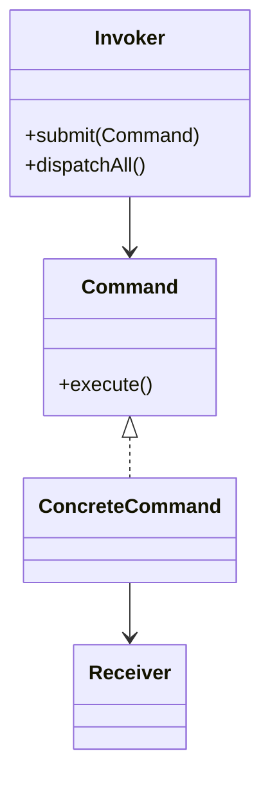

# 命令模式（行为型）

## 一句话总结
把“请求”封装成命令对象，让调用者与执行者解耦，并支持队列、日志、撤销等扩展能力。

---

## 问题与场景
- 调用方需要发起操作，但不应直接依赖具体执行逻辑。
- 业务希望支持“批量执行、异步队列、操作记录、撤销/重试”。
- 处理流程可能由配置决定，执行者可能随时替换。

---

## 模式意图
**将请求封装成对象**，使你可以用不同的请求对客户端进行参数化，并支持对请求的排队、记录、撤销等操作。

---

## 结构图


---

## 角色与职责
- Command：命令接口，定义执行行为。
- ConcreteCommand：封装请求参数，并调用 Receiver 完成操作。
- Receiver：真正执行业务逻辑的对象。
- Invoker：持有命令并触发执行（可做队列、日志、撤销）。

---

## 协作流程
1. Client 创建具体命令并注入 Receiver 与参数。
2. Client 将命令交给 Invoker。
3. Invoker 在合适时机执行命令（立即/批量/异步）。
4. Receiver 执行实际业务逻辑。

---

## 真实业务示例：订单操作的异步命令队列
场景：大促期间订单创建/取消请求暴增，需要削峰、记录操作并支持失败重试。

怎么用：
- API 层把“创建订单、取消订单”封装为命令，写入队列或命令表。
- 后台消费者按顺序拉取命令并执行，失败的命令可重试或人工处理。

为什么这样用：
- 请求被封装后可排队、落库，执行节奏可控。
- 命令天然是“操作记录”，便于审计与回放。

带来的收益：
- 低峰稳定执行，高峰时削峰填谷。
- 出错时可重试或补偿，系统更可靠。

---

## 代码示例（Java）
```java
import java.util.ArrayList;
import java.util.List;

public class CommandPatternDemo {
    public static void main(String[] args) {
        OrderService orderService = new OrderService();
        CommandBus commandBus = new CommandBus();

        commandBus.submit(new CreateOrderCommand(orderService, "user-1", "sku-1001", 2));
        commandBus.submit(new CancelOrderCommand(orderService, "order-20260116-0001"));
        commandBus.dispatchAll();
    }

    // 命令接口
    interface Command {
        void execute();
    }

    // 接收者：真实业务逻辑
    static class OrderService {
        public void create(String userId, String skuId, int amount) {
            System.out.println("创建订单：userId=" + userId + ", skuId=" + skuId + ", amount=" + amount);
        }

        public void cancel(String orderId) {
            System.out.println("取消订单：orderId=" + orderId);
        }
    }

    // 具体命令：创建订单
    static class CreateOrderCommand implements Command {
        private final OrderService orderService;
        private final String userId;
        private final String skuId;
        private final int amount;

        CreateOrderCommand(OrderService orderService, String userId, String skuId, int amount) {
            this.orderService = orderService;
            this.userId = userId;
            this.skuId = skuId;
            this.amount = amount;
        }

        public void execute() {
            orderService.create(userId, skuId, amount);
        }
    }

    // 具体命令：取消订单
    static class CancelOrderCommand implements Command {
        private final OrderService orderService;
        private final String orderId;

        CancelOrderCommand(OrderService orderService, String orderId) {
            this.orderService = orderService;
            this.orderId = orderId;
        }

        public void execute() {
            orderService.cancel(orderId);
        }
    }

    // 调用者：支持队列式执行
    static class CommandBus {
        private final List<Command> queue = new ArrayList<>();

        public void submit(Command command) {
            queue.add(command);
        }

        public void dispatchAll() {
            for (Command command : queue) {
                command.execute();
            }
            queue.clear();
        }
    }
}
```

关键点说明：
- 调用者只关心“发命令”，无需依赖具体业务。
- 命令对象天然可被记录、排队、重放。
- 命令一旦封装好，Invoker 的执行策略可以随时更换。

---

## 优缺点
优点：
- 解耦调用方与执行方，提升扩展性与可维护性。
- 易于支持队列、日志、撤销、重试等高级能力。

缺点：
- 命令类数量可能增多，带来类膨胀。
- 过度封装会增加理解成本和调用链复杂度。

---

## 适用/不适用
适用：
- 需要记录、排队、撤销或重放操作的场景。
- 调用方与执行方需要解耦的业务流程。

不适用：
- 简单直连调用更清晰的场景。
- 业务变化极少、没有扩展需求的功能。

---

## 常见误区
- 把所有动作都封成命令，导致类爆炸。
- 命令对象携带过多业务逻辑，破坏单一职责。
- Invoker 与 Receiver 耦合过深，违背解耦初衷。

---

## 相关模式
- 策略模式：策略是“选择一种算法”，命令是“封装一次请求”。
- 中介者模式：中介者协调多个对象，命令强调请求封装与执行。
- 责任链模式：责任链是“逐个尝试处理”，命令是“封装并执行一次”。

---

## 小结
- 命令模式把请求封装成对象，调用方无需关心执行细节。
- 适合需要排队、日志、撤销、重放的业务。
- 用好命令模式的关键是把“请求”与“执行者”解耦。
