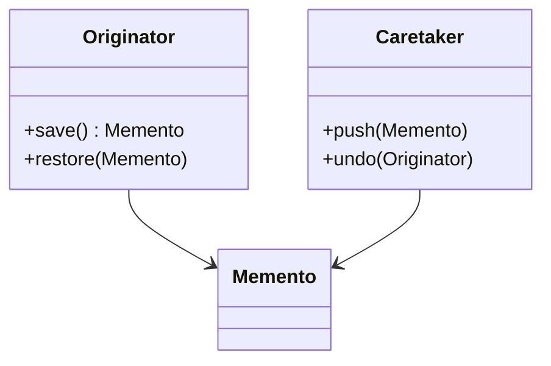

# 备忘录模式（行为型）

## 一句话总结
在不暴露对象内部结构的前提下，保存并恢复对象的历史状态。

---

## 问题与场景
- 需要“撤销/回滚/恢复”能力，但不想让外部直接操作内部状态。
- 状态变化频繁，且希望能够按时间回溯。
- 希望保存快照，同时保持对象封装性。

---

## 模式意图
**在不破坏封装的前提下捕获并保存对象内部状态**，以便之后恢复到该状态。

---

## 结构图


---

## 角色与职责
- Originator：需要保存/恢复状态的对象。
- Memento：状态快照，仅由 Originator 创建与读取。
- Caretaker：保存快照并在需要时触发恢复。

---

## 协作流程
1. Originator 在关键节点创建快照（Memento）。
2. Caretaker 负责存储快照（栈/列表/数据库）。
3. 需要回滚时，Caretaker 取出快照并让 Originator 恢复。

---

## 真实业务示例：运营配置的回滚
场景：活动配置变更频繁，发布后若出现问题需快速回滚到上一个版本。

怎么用：
- 每次发布前由配置对象生成快照，存入配置历史栈。
- 出现问题时从历史栈取出快照并恢复配置。

为什么这样用：
- 配置对象不对外暴露内部细节，回滚仍可安全进行。
- 快照可持久化，支持跨时间回溯与审计。

带来的收益：
- 回滚路径清晰，事故处理更快。
- 变更可追溯，降低线上风险。

---

## 代码示例（Java）
```java
import java.util.ArrayDeque;
import java.util.Deque;

public class MementoDemo {
    public static void main(String[] args) {
        Editor editor = new Editor();
        History history = new History();

        editor.setText("Hello");
        editor.setCursor(5);
        history.push(editor.save());

        editor.append(" World");
        editor.setCursor(11);
        history.push(editor.save());

        editor.append(" !!!");
        System.out.println("当前内容：" + editor);

        history.undo(editor);
        System.out.println("撤销一次：" + editor);

        history.undo(editor);
        System.out.println("撤销两次：" + editor);
    }

    // 发起者：编辑器
    static class Editor {
        private String text = "";
        private int cursor = 0;

        public void setText(String text) {
            this.text = text;
        }

        public void append(String extra) {
            this.text = this.text + extra;
        }

        public void setCursor(int cursor) {
            this.cursor = cursor;
        }

        public Snapshot save() {
            return new Snapshot(text, cursor);
        }

        public void restore(Snapshot snapshot) {
            if (snapshot == null) {
                return;
            }
            this.text = snapshot.text;
            this.cursor = snapshot.cursor;
        }

        public String toString() {
            return "Editor{text='" + text + "', cursor=" + cursor + "}";
        }

        // 备忘录：仅由 Editor 读写内部状态
        static class Snapshot {
            private final String text;
            private final int cursor;

            private Snapshot(String text, int cursor) {
                this.text = text;
                this.cursor = cursor;
            }
        }
    }

    // 负责人：管理快照
    static class History {
        private final Deque<Editor.Snapshot> stack = new ArrayDeque<>();

        public void push(Editor.Snapshot snapshot) {
            stack.push(snapshot);
        }

        public void undo(Editor editor) {
            if (!stack.isEmpty()) {
                editor.restore(stack.pop());
            }
        }
    }
}
```

关键点说明：
- 备忘录只保存状态，不暴露给外部修改。
- Caretaker 只负责存取快照，不理解内部结构。
- 需要注意快照大小与保存频率，避免内存压力。

---

## 优缺点
优点：
- 保持封装性，外部无需了解内部状态。
- 支持回滚、撤销、历史追溯等能力。

缺点：
- 快照数量多时占用内存，可能需要持久化或压缩。
- 对复杂对象的深拷贝实现成本较高。

---

## 适用/不适用
适用：
- 需要撤销/回滚的功能（编辑器、配置平台、审批流程）。
- 希望保留状态历史但又要保持封装性。

不适用：
- 状态变化极少，直接重算更简单的场景。
- 对象体积巨大且无法接受快照成本的系统。

---

## 常见误区
- 频繁保存全量快照，造成内存或存储膨胀。
- 对可变对象只做浅拷贝，导致历史被污染。
- Caretaker 直接访问快照内容，破坏封装。

---

## 相关模式
- 命令模式：命令可结合备忘录实现撤销。
- 原型模式：用于生成快照的深拷贝。
- 状态模式：状态模式关注“行为切换”，备忘录关注“状态回滚”。

---

## 小结
- 备忘录模式用于保存与恢复对象状态。
- 保持封装性，让回滚变得安全可控。
- 注意快照的成本与存储策略。
