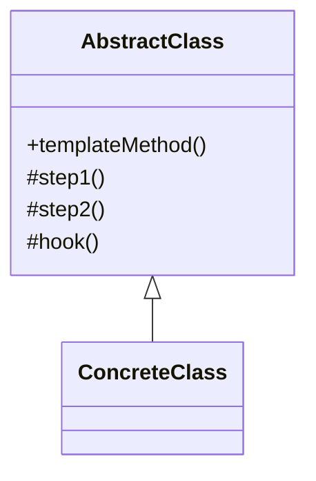

# 模板方法模式（行为型）

## 一句话总结
在父类定义算法骨架，把可变步骤交给子类实现。

---

## 问题与场景
- 多个流程大致相同，但某些步骤不同。
- 希望复用通用流程，避免重复代码。
- 需要约束执行顺序，同时保留扩展点。

---

## 模式意图
**定义算法的骨架**，将某些步骤延迟到子类中实现，不改变算法结构即可扩展细节。

---

## 结构图


---

## 角色与职责
- AbstractClass：定义模板方法和通用流程。
- ConcreteClass：实现差异化步骤。

---

## 协作流程
1. Client 调用模板方法。
2. 模板方法依次执行固定步骤。
3. 子类实现的步骤按约定被调用。

---

## 真实业务示例：多渠道通知发送
场景：短信、邮件、站内信发送流程相同，但具体发送方式不同。

怎么用：
- 父类定义“校验 → 组装内容 → 发送 → 记录日志”流程。
- 子类只实现具体发送逻辑（SMS/Email/站内信）。

为什么这样用：
- 固定流程不重复，扩展渠道只需新增子类。
- 可以统一日志、限流、失败处理等通用逻辑。

带来的收益：
- 代码复用高，新增渠道成本低。
- 发送流程更一致，稳定性更好。

---

## 代码示例（Java）
```java
public class TemplateMethodDemo {
    public static void main(String[] args) {
        Notifier sms = new SmsNotifier();
        Notifier email = new EmailNotifier();

        sms.send("user-1", "支付成功");
        email.send("user-2", "订单已发货");
    }

    // 抽象类：定义模板
    static abstract class Notifier {
        public final void send(String userId, String message) {
            if (!check(userId, message)) {
                System.out.println("校验失败");
                return;
            }
            String content = buildContent(userId, message);
            doSend(userId, content);
            log(userId, content);
        }

        protected boolean check(String userId, String message) {
            return userId != null && !userId.isEmpty() && message != null;
        }

        protected String buildContent(String userId, String message) {
            return "[系统通知] " + message + " (to " + userId + ")";
        }

        protected abstract void doSend(String userId, String content);

        protected void log(String userId, String content) {
            System.out.println("记录日志：" + userId + ", content=" + content);
        }
    }

    // 具体实现：短信
    static class SmsNotifier extends Notifier {
        protected void doSend(String userId, String content) {
            System.out.println("短信发送：" + content);
        }
    }

    // 具体实现：邮件
    static class EmailNotifier extends Notifier {
        protected void doSend(String userId, String content) {
            System.out.println("邮件发送：" + content);
        }
    }
}
```

关键点说明：
- 模板方法用 `final` 固定流程，子类只实现差异步骤。
- 通用步骤放在父类，避免重复逻辑。
- 可用钩子方法控制流程可扩展性。

---

## 优缺点
优点：
- 复用通用流程，减少重复代码。
- 约束流程顺序，提升一致性。

缺点：
- 继承结构固定，灵活性有限。
- 子类过多时，层级复杂度上升。

---

## 适用/不适用
适用：
- 多个业务流程结构一致但实现细节不同。
- 希望统一流程与日志的场景。

不适用：
- 流程高度动态且不可预测的场景。
- 不适合继承层级过深的系统。

---

## 常见误区
- 把过多差异放进父类，导致父类臃肿。
- 模板方法暴露过多扩展点，破坏流程约束。
- 子类随意重写通用步骤，造成逻辑不一致。

---

## 相关模式
- 策略模式：模板是固定流程，策略是可替换算法。
- 工厂方法：常用于创建模板步骤所需对象。
- 责任链模式：责任链是逐步处理，模板方法是固定流程。

---

## 小结
- 模板方法固定流程，子类负责实现差异步骤。
- 适合多渠道、多类型流程复用。
- 注意控制扩展点，避免父类膨胀。
