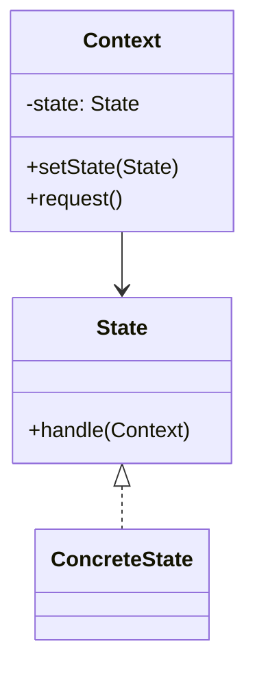

# 状态模式（行为型）

## 一句话总结
把对象在不同状态下的行为封装到不同状态类中，让状态切换替代复杂的条件分支。

---

## 问题与场景
- 对象有多种状态，行为随状态变化，if/else 很快变成“状态泥潭”。
- 新增状态或规则时，修改面大且容易引入 bug。
- 希望状态转换更清晰、可测试、可扩展。

---

## 模式意图
**允许对象在内部状态改变时改变其行为**，看起来像是修改了对象的类。

---

## 结构图


---

## 角色与职责
- State：定义状态行为接口。
- ConcreteState：具体状态，实现该状态下的行为。
- Context：持有当前状态并对外提供统一操作入口。

---

## 协作流程
1. Context 初始化为某一状态。
2. 调用 Context 的统一入口方法。
3. Context 委派给当前 State 执行行为。
4. State 根据业务条件切换到下一个状态。

---

## 真实业务示例：订单状态流转
场景：订单从“待支付 → 已支付 → 已发货 → 已完成/已取消”，不同状态下允许的操作不同。

怎么用：
- 为每个订单状态创建对应的 State 类，封装可执行操作。
- Context（订单）只暴露统一操作入口，内部根据状态决定行为。

为什么这样用：
- 将复杂的状态分支拆散为独立类，避免臃肿的 if/else。
- 新增状态只需新增类并调整流转，影响范围小。

带来的收益：
- 状态流转清晰、可测试。
- 规则变化时可控，降低维护成本。

---

## 代码示例（Java）
```java
public class StateDemo {
    public static void main(String[] args) {
        OrderContext order = new OrderContext();
        order.pay();
        order.ship();
        order.complete();
    }

    // 上下文：订单
    static class OrderContext {
        private OrderState state = new PendingPayState();

        public void setState(OrderState state) {
            this.state = state;
        }

        public void pay() {
            state.pay(this);
        }

        public void ship() {
            state.ship(this);
        }

        public void complete() {
            state.complete(this);
        }
    }

    // 状态接口
    interface OrderState {
        void pay(OrderContext ctx);
        void ship(OrderContext ctx);
        void complete(OrderContext ctx);
    }

    // 待支付
    static class PendingPayState implements OrderState {
        public void pay(OrderContext ctx) {
            System.out.println("支付成功");
            ctx.setState(new PaidState());
        }
        public void ship(OrderContext ctx) {
            System.out.println("未支付无法发货");
        }
        public void complete(OrderContext ctx) {
            System.out.println("未支付无法完成");
        }
    }

    // 已支付
    static class PaidState implements OrderState {
        public void pay(OrderContext ctx) {
            System.out.println("已支付无需重复支付");
        }
        public void ship(OrderContext ctx) {
            System.out.println("已发货");
            ctx.setState(new ShippedState());
        }
        public void complete(OrderContext ctx) {
            System.out.println("未发货无法完成");
        }
    }

    // 已发货
    static class ShippedState implements OrderState {
        public void pay(OrderContext ctx) {
            System.out.println("已发货无需支付");
        }
        public void ship(OrderContext ctx) {
            System.out.println("已发货无需重复发货");
        }
        public void complete(OrderContext ctx) {
            System.out.println("订单完成");
            ctx.setState(new CompletedState());
        }
    }

    // 已完成
    static class CompletedState implements OrderState {
        public void pay(OrderContext ctx) {
            System.out.println("订单已完成");
        }
        public void ship(OrderContext ctx) {
            System.out.println("订单已完成");
        }
        public void complete(OrderContext ctx) {
            System.out.println("订单已完成");
        }
    }
}
```

关键点说明：
- 状态类只处理本状态下的行为，并决定是否切换状态。
- Context 对外提供统一入口，内部委派给当前状态。
- 状态过多时可通过枚举或状态机配置进行管理。

---

## 优缺点
优点：
- 消除复杂条件分支，状态流转更清晰。
- 新增状态相对独立，扩展性好。

缺点：
- 状态类数量增加，代码量上升。
- 状态切换分散在多个类中，需规范管理。

---

## 适用/不适用
适用：
- 对象行为随状态变化且状态较多的场景。
- 状态转换规则复杂、频繁变更的业务。

不适用：
- 状态很少且逻辑简单的场景。
- 强一致状态流转需集中管理的系统（可用状态机框架）。

---

## 常见误区
- 状态类之间直接互相调用，导致耦合回升。
- 把大量业务逻辑留在 Context，状态类空洞。
- 状态切换条件分散，缺少统一约束与测试。

---

## 相关模式
- 状态机：状态模式的工程化升级，适合复杂流转。
- 策略模式：策略强调“可替换算法”，状态强调“随状态变化的行为”。
- 命令模式：命令封装请求，状态决定是否允许执行。

---

## 小结
- 状态模式让状态与行为解耦，避免 if/else 泥潭。
- 适合订单、审批、任务流等多状态流程。
- 注意控制状态数量与切换规则的可维护性。
