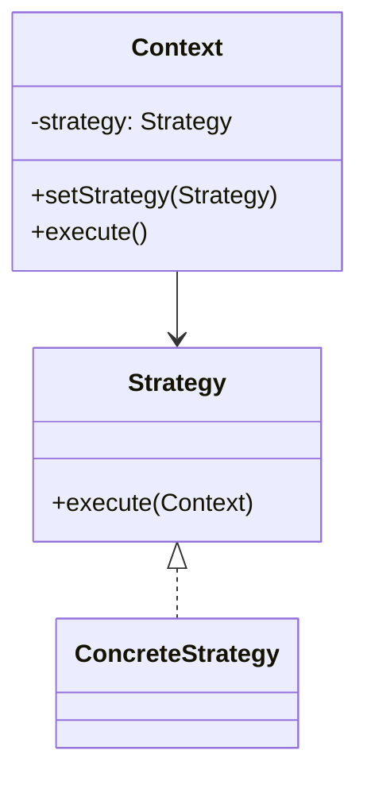

# 策略模式（行为型）

## 一句话总结
把可互换的算法封装成策略，让调用方在运行时灵活选择。

---

## 问题与场景
- 同一业务存在多种算法或规则（计费、风控、推荐等）。
- if/else 或 switch 分支不断增加，代码难维护。
- 需要按配置、用户类型或业务条件动态切换算法。

---

## 模式意图
**定义一系列算法，并将其封装起来，使它们可以互相替换**，算法的变化独立于使用它的客户端。

---

## 结构图


---

## 角色与职责
- Strategy：策略接口，定义统一算法入口。
- ConcreteStrategy：具体策略，实现某一种算法。
- Context：持有策略并对外提供调用。

---

## 协作流程
1. Client 根据条件选择具体策略。
2. Context 持有策略。
3. Context 调用策略执行算法。

---

## 真实业务示例：对接多家 AI 服务
场景：同一业务需要根据成本、延迟或模型能力选择不同的 AI 服务（OpenAI/本地大模型/第三方）。

怎么用：
- 把“请求 AI 模型”的逻辑封装成不同策略。
- 根据配置或用户等级选择具体策略执行。

为什么这样用：
- 新增/替换 AI 服务只需新增策略类。
- 业务层不依赖具体供应商实现。

带来的收益：
- 更快接入新模型，降低供应商锁定风险。
- 策略切换可控，便于灰度与成本优化。

---

## 代码示例（Java）
```java
public class StrategyDemo {
    public static void main(String[] args) {
        AiContext context = new AiContext();
        context.setStrategy(new OpenAiStrategy());
        System.out.println(context.ask("生成产品标题"));

        context.setStrategy(new LocalAiStrategy());
        System.out.println(context.ask("生成产品标题"));
    }

    // 策略接口
    interface AiStrategy {
        String generate(String prompt);
    }

    // 具体策略：OpenAI
    static class OpenAiStrategy implements AiStrategy {
        public String generate(String prompt) {
            return "OpenAI 返回：" + prompt;
        }
    }

    // 具体策略：本地模型
    static class LocalAiStrategy implements AiStrategy {
        public String generate(String prompt) {
            return "本地模型返回：" + prompt;
        }
    }

    // 上下文
    static class AiContext {
        private AiStrategy strategy;

        public void setStrategy(AiStrategy strategy) {
            this.strategy = strategy;
        }

        public String ask(String prompt) {
            if (strategy == null) {
                return "未配置策略";
            }
            return strategy.generate(prompt);
        }
    }
}
```

关键点说明：
- 策略封装算法细节，Context 只负责委派。
- 通过配置或路由规则切换策略。
- 策略过多时可用工厂或注册表管理。

---

## 优缺点
优点：
- 消除复杂条件分支，便于扩展。
- 算法可互换，支持动态切换。

缺点：
- 策略类数量增加，管理成本上升。
- Client 需要了解策略的选择逻辑。

---

## 适用/不适用
适用：
- 同一问题有多种算法或规则。
- 需要根据条件动态切换实现。

不适用：
- 算法非常少且稳定，直接 if/else 更简单。
- 算法间差异很小，不值得抽象。

---

## 常见误区
- 把策略选择逻辑散落在多个地方，难以维护。
- 策略之间共享状态，导致耦合增加。
- 过度抽象，策略数量多但使用频率低。

---

## 相关模式
- 工厂方法：用于创建与管理策略对象。
- 状态模式：状态强调行为随状态变化，策略强调可替换算法。
- 命令模式：命令封装请求，策略封装算法。

---

## 小结
- 策略模式让算法可替换，避免条件分支膨胀。
- 适合对接多供应商、规则多变的业务。
- 注意策略选择逻辑的集中管理。
