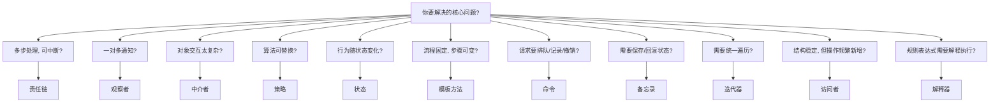
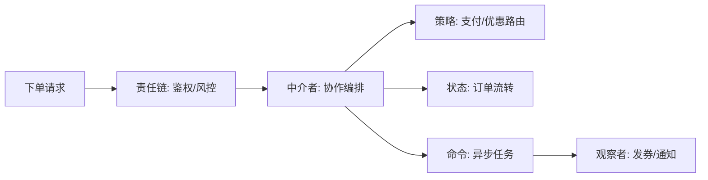

# 行为模式总览：更细致的选择与组合指南

这篇不是“逐个解释模式”，而是告诉你：**面对一个协作问题，到底该选哪种行为模式**。我会用更清晰的分类、选择路径、模式卡片和对比表来讲，让你看到一个完整的“选择地图”。

---

## 先把问题分成 5 类
行为模式并不神秘，本质上只是把“协作与变化”分门别类：
- **协作复杂**：对象互相调用变成网状关系（中介者、责任链、观察者）。
- **行为可变**：算法/流程/状态变化频繁（策略、状态、模板方法）。
- **请求与历史**：需要排队、记录、撤销、回滚（命令、备忘录）。
- **遍历与操作**：需要统一遍历或新增操作（迭代器、访问者）。
- **规则解释**：规则需要配置化解释执行（解释器）。

这 5 类把所有行为模式几乎都覆盖了。

---

## 快速选择路径（先问这些问题）

---

## 模式卡片（11 个，一次看清）

### 1) 责任链
- **核心问题**：多步处理 + 逐级尝试 + 可短路。
- **怎么用**：处理器串成链，每个处理器决定“处理/放行”。
- **适用信号**：规则经常增删改；顺序可配置；要短路失败。
- **不适用信号**：必须同时执行所有步骤；顺序固定且简单。
- **典型场景**：过滤器链、审批链、校验链。

### 2) 命令
- **核心问题**：把请求封装成对象，便于排队/记录/撤销。
- **怎么用**：Command + Invoker + Receiver。
- **适用信号**：需要异步队列、操作日志、重放/重试。
- **不适用信号**：简单同步调用即可，新增类成本过高。
- **典型场景**：任务队列、批处理、撤销操作。

### 3) 解释器
- **核心问题**：用一套语法解释规则或表达式。
- **怎么用**：把规则拆成 AST 并解释执行。
- **适用信号**：规则频繁变化且由配置驱动。
- **不适用信号**：规则简单，用 if/else 或策略更清晰。
- **典型场景**：风控规则、权限表达式、复杂筛选。

### 4) 迭代器
- **核心问题**：统一遍历方式，隐藏集合内部结构。
- **怎么用**：集合提供 iterator，外部通过迭代器遍历。
- **适用信号**：多数据源遍历；不想暴露内部结构。
- **不适用信号**：集合简单且遍历逻辑固定。
- **典型场景**：分页遍历、游标遍历、批量导出。

### 5) 中介者
- **核心问题**：多对象交互复杂，依赖变成网状。
- **怎么用**：所有交互通过中介者协调。
- **适用信号**：模块之间互相调用频繁且流程可变。
- **不适用信号**：对象很少、交互简单；需要去中心化。
- **典型场景**：订单履约编排、库存/支付/物流协作。

### 6) 备忘录
- **核心问题**：保存与恢复历史状态。
- **怎么用**：Originator 保存快照，Caretaker 管理历史。
- **适用信号**：需要撤销/回滚/审计。
- **不适用信号**：对象巨大、快照成本过高。
- **典型场景**：配置回滚、编辑器撤销、事务补偿。

### 7) 观察者
- **核心问题**：一对多事件通知，订阅者可插拔。
- **怎么用**：Subject 维护订阅者并广播事件。
- **适用信号**：事件发生后有多种下游处理。
- **不适用信号**：强顺序、强一致场景。
- **典型场景**：支付成功后发券/积分/通知。

### 8) 状态
- **核心问题**：对象行为随状态变化。
- **怎么用**：每个状态一个类，状态切换驱动行为。
- **适用信号**：状态多、规则复杂、if/else 失控。
- **不适用信号**：状态极少且逻辑简单。
- **典型场景**：订单/工单/流程状态流转。

### 9) 策略
- **核心问题**：算法可替换、可按条件切换。
- **怎么用**：策略接口 + 多个实现 + 运行时选择。
- **适用信号**：多供应商、多算法、多规则路由。
- **不适用信号**：算法差异小、变化少。
- **典型场景**：支付路由、AI 模型路由、计费策略。

### 10) 模板方法
- **核心问题**：流程骨架固定，步骤差异化。
- **怎么用**：父类定义流程，子类实现可变步骤。
- **适用信号**：流程一致但细节不同。
- **不适用信号**：流程高度动态、不适合继承。
- **典型场景**：多渠道通知、导入导出流程。

### 11) 访问者
- **核心问题**：结构稳定但操作频繁新增。
- **怎么用**：元素 accept 访问者，访问者实现操作。
- **适用信号**：新增“操作”比新增“元素”频繁。
- **不适用信号**：元素类型经常变化。
- **典型场景**：内容导出、报表统计、AST 处理。

---

## 易混淆对比（最常见 6 组）

| 对比 | 关键差别 | 选用建议 |
| --- | --- | --- |
| 策略 vs 状态 | 策略是“可替换算法”，状态是“行为随状态变化” | 若强调“状态流转”，选状态 |
| 观察者 vs 中介者 | 观察者是广播通知，中介者是集中编排 | 需要流程编排选中介者 |
| 责任链 vs 观察者 | 责任链是逐级处理可中断，观察者是并行通知 | 需要短路选责任链 |
| 命令 vs 策略 | 命令封装“请求”，策略封装“算法” | 要排队/撤销选命令 |
| 模板方法 vs 策略 | 模板固定流程，策略替换算法 | 流程骨架固定选模板 |
| 访问者 vs 迭代器 | 访问者扩展操作，迭代器负责遍历 | 需要新增操作选访问者 |

---

## 常见组合套路（真实工程里经常一起出现）
- **责任链 + 策略**：链路前置校验，最终路由到不同策略。
- **中介者 + 状态**：中介者编排流程，状态控制流转阶段。
- **命令 + 备忘录**：命令执行前保存快照，实现可撤销。
- **观察者 + 模板方法**：事件广播后，各通知渠道复用模板流程。
- **迭代器 + 访问者**：迭代器遍历结构，访问者执行多种操作。

---

## 一个更清晰的组合示例（订单履约）

这张图的目的不是让你“全都用”，而是告诉你：  
- **不同问题有不同变化点**，拆开管理比堆在一起更清晰。  
- **行为模式是可组合的**，但每个模式都只负责一类问题。

---

## 选择时的 5 条检查清单
- 变化点是什么？是算法、流程、状态、协作，还是历史记录？
- 需要短路处理还是并行通知？
- 对象结构是否稳定？操作是否频繁新增？
- 是否需要回滚、重放、审计或异步排队？
- 这个抽象的收益是否足够覆盖新增复杂度？

---

## 阅读建议（从常用到不常用）
1. 策略 / 责任链 / 观察者  
2. 状态 / 模板方法 / 命令  
3. 中介者 / 备忘录 / 迭代器  
4. 访问者 / 解释器（了解即可，使用频率较低）

---

## 小结
行为模式的核心是“让协作更清晰、变化更可控”。  
先定位问题类型，再选模式并组合使用，才是最快的正确路径。
