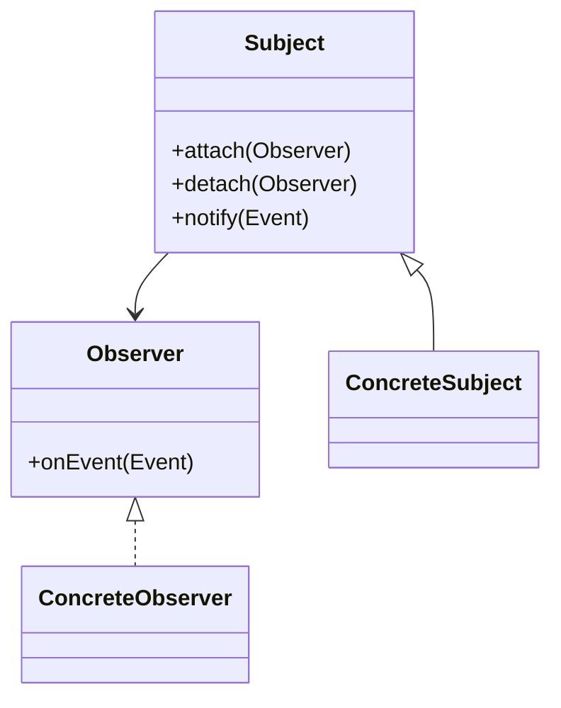

# 观察者模式（行为型）

## 一句话总结
当一个对象状态变化时，自动通知并更新所有依赖它的对象。

---

## 问题与场景
- 一个事件发生后，需要触发多个后续动作（通知、发券、积分、日志等）。
- 不希望发布者直接依赖各个订阅者，避免耦合过深。
- 订阅者可能增删变化，要求动态扩展。

---

## 模式意图
**定义对象间一对多的依赖关系**，当一个对象改变状态时，所有依赖于它的对象都会收到通知并自动更新。

---

## 结构图


---

## 角色与职责
- Subject：维护观察者列表并负责通知。
- Observer：定义接收通知的接口。
- ConcreteSubject：状态发生变化时触发通知。
- ConcreteObserver：具体订阅者，处理事件。

---

## 协作流程
1. Observer 订阅 Subject。
2. Subject 状态发生变化。
3. Subject 通知所有 Observer。
4. Observer 执行各自逻辑。

---

## 真实业务示例：订单支付成功后的多路通知
场景：用户完成支付后，需要发券、加积分、推送通知、记录埋点。

怎么用：
- 订单服务只负责发布“支付成功事件”。
- 发券、积分、推送、埋点各自订阅该事件并处理。

为什么这样用：
- 订单服务无需依赖多个下游模块。
- 下游模块可独立增删，不影响主流程。

带来的收益：
- 主流程更简洁，系统更可扩展。
- 事件驱动便于异步化与削峰处理。

---

## 代码示例（Java）
```java
import java.util.ArrayList;
import java.util.List;

public class ObserverDemo {
    public static void main(String[] args) {
        OrderEventBus bus = new OrderEventBus();
        bus.attach(new CouponObserver());
        bus.attach(new PointsObserver());
        bus.attach(new NotifyObserver());

        bus.publish(new OrderPaidEvent("order-001", "user-1", 199));
    }

    // 事件对象
    static class OrderPaidEvent {
        final String orderId;
        final String userId;
        final int amount;
        OrderPaidEvent(String orderId, String userId, int amount) {
            this.orderId = orderId;
            this.userId = userId;
            this.amount = amount;
        }
    }

    // 观察者接口
    interface Observer {
        void onEvent(OrderPaidEvent event);
    }

    // 主题
    static class OrderEventBus {
        private final List<Observer> observers = new ArrayList<>();

        public void attach(Observer observer) {
            observers.add(observer);
        }

        public void detach(Observer observer) {
            observers.remove(observer);
        }

        public void publish(OrderPaidEvent event) {
            for (Observer observer : observers) {
                observer.onEvent(event);
            }
        }
    }

    // 具体观察者：发券
    static class CouponObserver implements Observer {
        public void onEvent(OrderPaidEvent event) {
            System.out.println("发券：userId=" + event.userId);
        }
    }

    // 具体观察者：加积分
    static class PointsObserver implements Observer {
        public void onEvent(OrderPaidEvent event) {
            System.out.println("加积分：userId=" + event.userId + ", amount=" + event.amount);
        }
    }

    // 具体观察者：通知
    static class NotifyObserver implements Observer {
        public void onEvent(OrderPaidEvent event) {
            System.out.println("通知用户：orderId=" + event.orderId);
        }
    }
}
```

关键点说明：
- Subject 只负责通知，不关心订阅者做什么。
- 观察者可动态增删，支持业务扩展。
- 注意通知失败的处理策略（重试/隔离/降级）。

---

## 优缺点
优点：
- 解耦发布者与订阅者，扩展性强。
- 可将同步流程转为事件驱动，提高灵活性。

缺点：
- 观察者过多时通知成本增加。
- 事件链路难以追踪，需要良好监控。

---

## 适用/不适用
适用：
- 多个模块对同一事件有反应的场景。
- 订阅者经常变化或可插拔的系统。

不适用：
- 强顺序、强依赖的流程（更适合责任链/中介者）。
- 事件处理必须同步且强一致的场景。

---

## 常见误区
- 事件处理失败未隔离，导致主流程被拖慢。
- 过度同步通知，失去解耦优势。
- 订阅者职责混乱，重复处理同一业务。

---

## 相关模式
- 中介者模式：中介者是集中协调，观察者是广播通知。
- 责任链模式：责任链是逐个处理，观察者是并行响应。
- 事件总线：是观察者的工程化实现。

---

## 小结
- 观察者模式用于“一对多事件通知”。
- 订阅者可插拔，主流程更简洁。
- 注意通知成本与链路可观测性。
