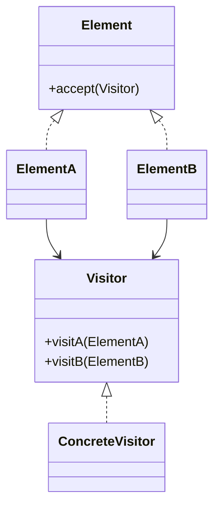

# 访问者模式（行为型）

## 一句话总结
将操作从对象结构中抽离出来，让“新增操作”比“新增节点类型”更容易。

---

## 问题与场景
- 对象结构稳定，但需要频繁新增不同操作（统计、导出、校验）。
- 不希望每次新增操作都修改各个元素类。
- 需要对不同元素类型执行不同逻辑。

---

## 模式意图
**表示一个作用于某对象结构中各元素的操作**，使你可以在不改变元素类的前提下定义新操作。

---

## 结构图


---

## 角色与职责
- Visitor：定义对不同元素的访问接口。
- ConcreteVisitor：具体操作实现（统计/导出/校验）。
- Element：定义接收访问者的接口。
- ConcreteElement：具体元素，负责回调访问者。

---

## 协作流程
1. Client 创建访问者。
2. Client 遍历元素结构并调用 `accept`。
3. 元素回调访问者的具体 `visitX`。
4. 访问者执行与元素相关的操作。

---

## 真实业务示例：内容管理系统的多种导出
场景：文章、视频、课程等内容结构固定，但需要新增“导出 PDF/导出摘要/生成 SEO 报告”等操作。

怎么用：
- 每个内容类型实现 `accept`，交给访问者处理。
- 新增导出需求时，只新增访问者类，不改内容类。

为什么这样用：
- 内容模型稳定，操作需求频繁变化。
- 避免在每个内容类中不断增加新方法。

带来的收益：
- 新增操作成本低，不破坏既有模型。
- 多种导出逻辑集中管理，便于演进。

---

## 代码示例（Java）
```java
import java.util.ArrayList;
import java.util.List;

public class VisitorDemo {
    public static void main(String[] args) {
        List<Content> contents = new ArrayList<>();
        contents.add(new Article("设计模式概览", 1200));
        contents.add(new Video("Java 访问者模式", 360));

        Visitor exporter = new PdfExportVisitor();
        for (Content content : contents) {
            content.accept(exporter);
        }
    }

    // 访问者接口
    interface Visitor {
        void visitArticle(Article article);
        void visitVideo(Video video);
    }

    // 具体访问者：导出 PDF
    static class PdfExportVisitor implements Visitor {
        public void visitArticle(Article article) {
            System.out.println("导出文章 PDF：" + article.title + ", words=" + article.words);
        }
        public void visitVideo(Video video) {
            System.out.println("导出视频 PDF：" + video.title + ", duration=" + video.seconds);
        }
    }

    // 元素接口
    interface Content {
        void accept(Visitor visitor);
    }

    // 具体元素：文章
    static class Article implements Content {
        final String title;
        final int words;
        Article(String title, int words) {
            this.title = title;
            this.words = words;
        }
        public void accept(Visitor visitor) {
            visitor.visitArticle(this);
        }
    }

    // 具体元素：视频
    static class Video implements Content {
        final String title;
        final int seconds;
        Video(String title, int seconds) {
            this.title = title;
            this.seconds = seconds;
        }
        public void accept(Visitor visitor) {
            visitor.visitVideo(this);
        }
    }
}
```

关键点说明：
- 访问者让“新增操作”更简单，但“新增元素类型”更昂贵。
- `accept` 是双分派的关键，确保访问者拿到具体类型。
- 元素结构稳定时，访问者模式最有价值。

---

## 优缺点
优点：
- 新增操作只需新增访问者类，扩展性好。
- 操作集中，逻辑清晰，便于维护。

缺点：
- 新增元素类型需要修改所有访问者。
- 访问者与元素类型耦合较强。

---

## 适用/不适用
适用：
- 元素结构稳定，操作频繁变化。
- 需要对不同元素执行不同逻辑。

不适用：
- 元素类型经常变动的系统。
- 结构简单、直接在元素内实现更清晰的场景。

---

## 常见误区
- 元素类型频繁新增却仍使用访问者，维护成本极高。
- 访问者过多且逻辑重复，导致分散。
- 忽略双分派导致类型判断回到 if/else。

---

## 相关模式
- 组合模式：访问者常用于遍历组合结构。
- 迭代器模式：负责遍历，访问者负责操作。
- 策略模式：策略是算法替换，访问者是操作扩展。

---

## 小结
- 访问者适合“结构稳定、操作多变”的场景。
- 新增操作非常容易，但新增元素代价高。
- 使用前先评估元素结构是否稳定。
