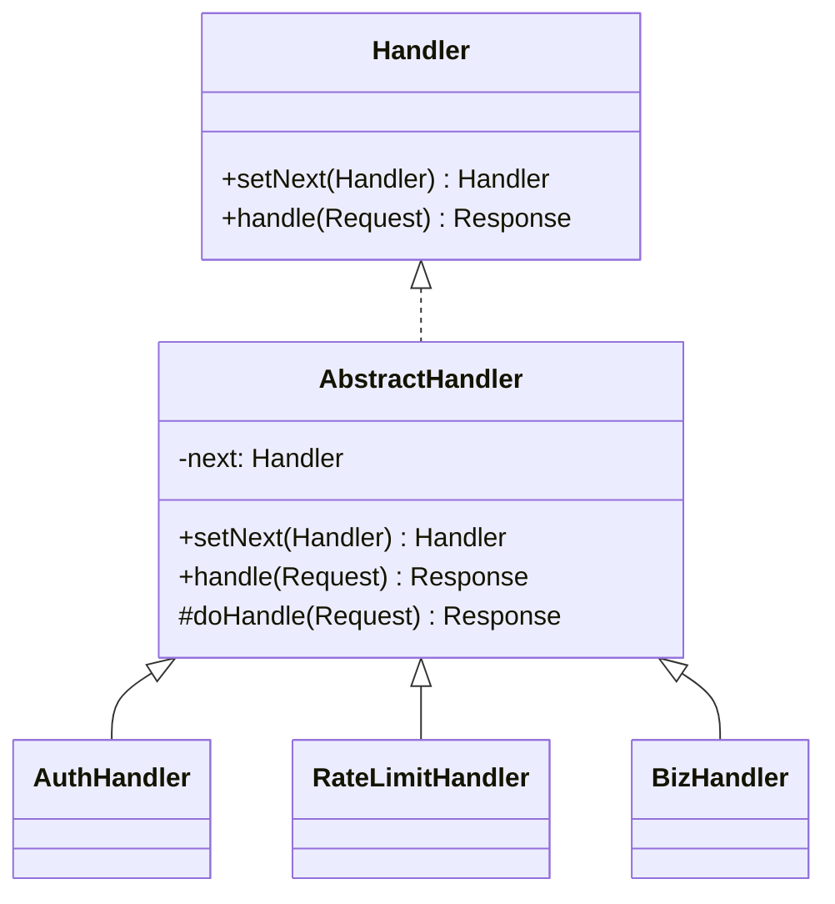

# 责任链模式（行为型）

## 一句话总结
把一组处理器串成链，请求沿链传递，直到被某个处理器处理或到达链尾。

---

## 问题与场景
- 需要一套“流水线式”的处理流程，例如登录校验、限流、权限、业务校验、风控。
- 处理规则经常增删改，且顺序可能变化。
- 希望调用方不关心具体由谁处理，只管把请求丢进来。

---

## 模式意图
**解耦请求发送者与多个处理者**，使多个对象都有机会处理请求，并且可以在运行时灵活组合处理顺序。

---

## 结构图


---

## 角色与职责
- Handler：定义处理请求与设置下一个处理器的接口。
- AbstractHandler：封装链式调用逻辑，统一处理“传递给下一个”。
- ConcreteHandler：实现具体规则（认证、限流、业务校验等）。
- Client：组装责任链并发起请求。

---

## 协作流程
1. Client 创建并按顺序串联处理器。
2. 请求进入链头（第一个处理器）。
3. 当前处理器尝试处理；若不能处理或校验通过，转交给下一个。
4. 若链尾仍未处理，返回默认结果或错误。

---

## 代码示例（Java）
```java
import java.util.Objects;

public class ChainDemo {
    public static void main(String[] args) {
        Handler chain = new AuthHandler()
            .setNext(new RateLimitHandler())
            .setNext(new BizHandler());

        Request ok = new Request("user-1", "token-abc", 2);
        Request bad = new Request("user-1", "", 2);

        System.out.println(chain.handle(ok));   // Response{ok=true, msg='订单创建成功'}
        System.out.println(chain.handle(bad));  // Response{ok=false, msg='未登录或令牌非法'}
    }

    // 请求与响应
    static class Request {
        final String userId;
        final String token;
        final int amount;
        Request(String userId, String token, int amount) {
            this.userId = userId;
            this.token = token;
            this.amount = amount;
        }
    }

    static class Response {
        final boolean ok;
        final String msg;
        Response(boolean ok, String msg) {
            this.ok = ok;
            this.msg = msg;
        }
        public String toString() {
            return "Response{ok=" + ok + ", msg='" + msg + "'}";
        }
        static Response ok(String msg) { return new Response(true, msg); }
        static Response fail(String msg) { return new Response(false, msg); }
    }

    // 责任链接口
    interface Handler {
        Handler setNext(Handler next);
        Response handle(Request request);
    }

    // 抽象处理器，封装链式调用
    static abstract class AbstractHandler implements Handler {
        private Handler next;

        public Handler setNext(Handler next) {
            this.next = next;
            return next;
        }

        public Response handle(Request request) {
            Response res = doHandle(request);
            if (res != null) {
                return res;
            }
            if (next == null) {
                return Response.fail("没有处理器处理该请求");
            }
            return next.handle(request);
        }

        protected abstract Response doHandle(Request request);
    }

    // 具体处理器：认证
    static class AuthHandler extends AbstractHandler {
        protected Response doHandle(Request request) {
            if (Objects.isNull(request) || request.token == null || request.token.isEmpty()) {
                return Response.fail("未登录或令牌非法");
            }
            return null;
        }
    }

    // 具体处理器：限流/风控
    static class RateLimitHandler extends AbstractHandler {
        protected Response doHandle(Request request) {
            if (request.amount > 5) {
                return Response.fail("触发限流或风控");
            }
            return null;
        }
    }

    // 具体处理器：业务处理
    static class BizHandler extends AbstractHandler {
        protected Response doHandle(Request request) {
            return Response.ok("订单创建成功");
        }
    }
}
```

关键点说明：
- `AbstractHandler` 统一了“本处理器处理/放行给下一个”的逻辑。
- 处理器返回 `null` 表示继续传递；返回非空则终止链路。
- 链条顺序可在运行时调整，适合规则经常变化的场景。

---

## 优缺点
优点：
- 解耦调用方与处理器，实现可插拔的处理流程。
- 易于扩展，新增处理器不影响其他逻辑。

缺点：
- 链路过长时排查问题困难。
- 处理顺序强依赖配置，错误顺序会引发逻辑错误。

---

## 适用/不适用
适用：
- 多步校验、审批流、过滤器链、拦截器链。
- 规则经常变动、需要灵活增删处理步骤的场景。

不适用：
- 需要明确“唯一处理者”的场景（更适合策略/命令）。
- 处理器间有强顺序依赖且固定不变的流程。

---

## 常见误区
- 链条过长却没有观测点，导致排查困难。
- 返回值设计不清晰，导致“放行/终止”语义混乱。
- 把过多业务逻辑塞进抽象层，降低扩展性。

---

## 相关模式
- 策略模式：策略是“单一选择”，责任链是“逐个尝试”。
- 命令模式：命令封装请求，责任链负责传递与筛选。
- 装饰器模式：装饰器强调增强；责任链强调选择性处理。

---

## 小结
- 责任链把请求从发送者转移到一组处理器。
- 通过链式结构实现解耦与可扩展流程。
- 适合过滤器/拦截器/审批等多阶段处理。
- 需要注意顺序配置与链路可观测性。
