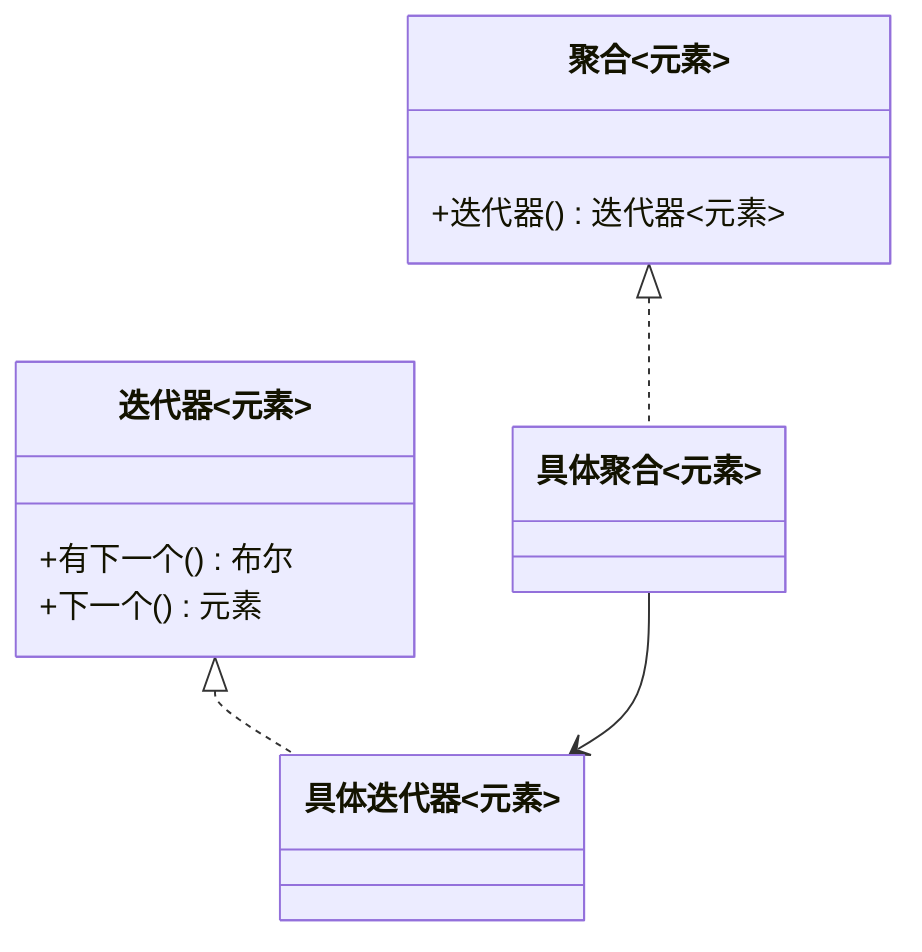

# 迭代器模式（行为型）

## 一句话总结
将集合的遍历逻辑封装在迭代器中，让客户端在不暴露内部结构的情况下顺序访问元素。

---

## 问题与场景
- 需要遍历不同的数据结构（数组、链表、树），但希望对外统一“遍历方式”。
- 不想暴露集合内部实现细节，避免外部直接操作底层数据。
- 需要多种遍历策略（顺序、倒序、过滤）并能独立演进。

---

## 模式意图
**提供一种方法顺序访问聚合对象中的各个元素，而无需暴露其内部表示**。

---

## 结构图


---

## 角色与职责
- 迭代器：定义遍历接口（hasNext/next）。
- 具体迭代器：保存遍历位置，负责具体遍历逻辑。
- 聚合：定义创建迭代器的接口。
- 具体聚合：具体集合，返回其对应的迭代器。

---

## 协作流程
1. 客户端 向 聚合 请求迭代器。
2. 迭代器保存遍历状态（索引/节点指针）。
3. 客户端 通过迭代器依次访问元素。
4. 遍历结束后，客户端 停止访问。

---

## 真实业务示例：订单导出与批量处理
场景：订单数据来自不同存储（内存缓存、数据库游标、搜索引擎），导出服务只关心“顺序遍历”。

怎么用：
- 仓储层对外只暴露 `迭代器()`，内部决定是 List、分页查询还是游标。
- 导出服务统一按迭代器读取并写入文件或消息队列。

为什么这样用：
- 遍历逻辑与存储结构解耦，导出逻辑不必适配不同数据源。
- 当数据量增大时，可切换为流式迭代，避免内存膨胀。

带来的收益：
- 更易扩展数据来源，业务层代码稳定。
- 大数据量场景下性能更稳、内存更可控。

---

## 代码示例（Java）
```java
import java.util.ArrayList;
import java.util.List;

public class IteratorPatternDemo {
    public static void main(String[] args) {
        OrderRepository repo = new OrderRepository();
        repo.add(new Order("order-001", 128));
        repo.add(new Order("order-002", 256));
        repo.add(new Order("order-003", 64));

        Iterator<Order> it = repo.iterator();
        while (it.hasNext()) {
            Order order = it.next();
            System.out.println(order);
        }
    }

    // 迭代器接口
    interface Iterator<T> {
        boolean hasNext();
        T next();
    }

    // 聚合接口
    interface Aggregate<T> {
        Iterator<T> iterator();
    }

    // 具体集合
    static class OrderRepository implements Aggregate<Order> {
        private final List<Order> data = new ArrayList<>();

        public void add(Order order) {
            data.add(order);
        }

        public Iterator<Order> iterator() {
            return new OrderIterator(data);
        }
    }

    // 具体迭代器
    static class OrderIterator implements Iterator<Order> {
        private final List<Order> data;
        private int index = 0;

        OrderIterator(List<Order> data) {
            this.data = data;
        }

        public boolean hasNext() {
            return index < data.size();
        }

        public Order next() {
            return data.get(index++);
        }
    }

    // 业务对象
    static class Order {
        private final String id;
        private final int amount;

        Order(String id, int amount) {
            this.id = id;
            this.amount = amount;
        }

        public String toString() {
            return "Order{id='" + id + "', amount=" + amount + "}";
        }
    }
}
```

关键点说明：
- 迭代器持有遍历状态，客户端无需关心集合内部结构。
- 聚合对象对外只暴露 `迭代器()`，隐藏数据组织方式。
- 可在不修改集合的情况下新增遍历策略（如倒序/过滤）。

---

## 优缺点
优点：
- 统一遍历方式，隐藏内部结构，提高封装性。
- 易于扩展不同遍历策略，互不影响集合本身。

缺点：
- 对简单集合而言，抽象层次可能显得冗余。
- 迭代器数量增多时，维护成本上升。

---

## 适用/不适用
适用：
- 需要统一遍历多种集合结构的场景。
- 需要隐藏集合内部实现细节。

不适用：
- 极简单的数据结构，直接遍历更直观。
- 访问逻辑高度依赖内部结构时，迭代器反而增加复杂度。

---

## 常见误区
- 把遍历逻辑写回集合，破坏“遍历与存储分离”。
- 迭代器暴露过多内部细节，失去封装价值。
- 忽略并发修改导致的遍历一致性问题。

---

## 相关模式
- 组合模式：常与迭代器一起使用来遍历树形结构。
- 访问者模式：访问者负责操作，迭代器负责顺序。
- 工厂方法：用于创建不同类型的迭代器。

---

## 小结
- 迭代器模式让遍历与集合存储解耦。
- 适合统一遍历不同结构的集合。
- 通过迭代器封装状态，可扩展多种遍历方式。
